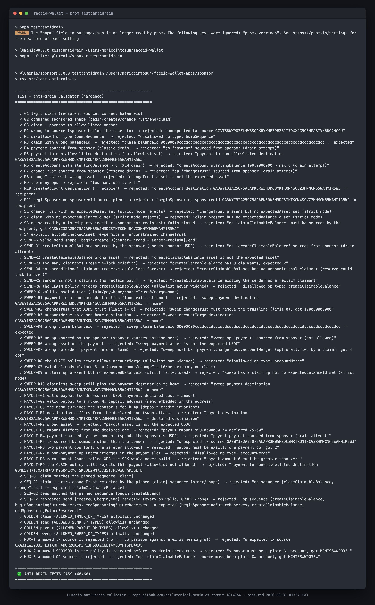
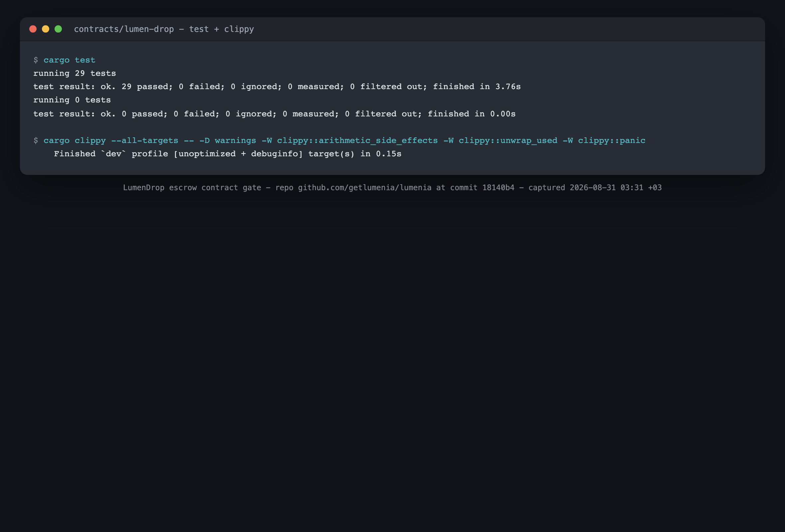
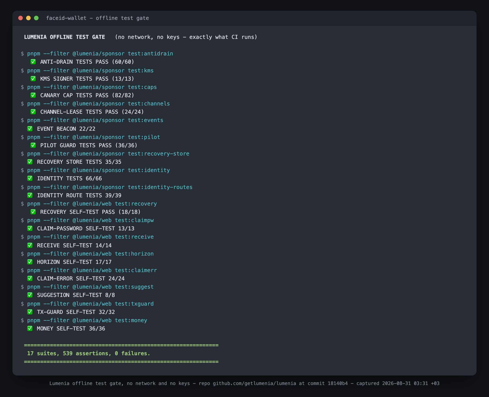

# Instawards evidence: Lumenia

Reviewer-facing evidence for both of Lumenia's Instawards. Each claim can be checked without trusting
us: open the explorer links, or re-run the commands.

- **SOW 2, the follow-on (2026-09-17 to 2026-10-16), comes first.** It covers a sender-side browser
  extension, links that are private by default, and the work that makes opening mainnet a
  configuration change. Real money is involved: since 2026-07-26 a hand-approved, capped mainnet
  pilot has moved real Circle USDC. Everything else, every test link included, runs on the public
  Stellar testnet ("practice money").
- **SOW 1, the first sprint ([INSTAWARDS_SOW.md](INSTAWARDS_SOW.md), June to July 2026, closed)**
  follows it. Its deliverables were testnet only. Its text is kept as written then; where a
  statement is no longer true it carries a dated correction instead of a silent rewrite.
- SOW 1 closeout, 2026-08-31, a two-page summary: [`evidence/lumenia-evidence-pack.pdf`](evidence/lumenia-evidence-pack.pdf).
  Erratum and update (2026-10-09): since 2026-09-18 the escrow's owner is a 2-of-3 multisig, no longer
  a single key; 8.78 percent is the World Bank's Sub-Saharan Africa average for remittances and 6.49 percent
  the global one; the 109 mainnet transfers it counts moved about $4.4 in total; and 0.145 percent
  was the trading fee on the one cash-out walked by hand, not a ledger cost.

---

## SOW 2 (2026-09-17 to 2026-10-16)

The SOW suggested 2026-09-10 as the start date; the sprint ran from 2026-09-17. Its success metric,
verbatim:

> "(1) A walletless send initiated from the published browser extension and claimed on mainnet,
> evidenced by a public transaction hash; (2) a private-by-default link whose chat preview and URL
> carry no amount and no sender name, claimed on mainnet, evidenced the same way; (3) the
> open-mainnet readiness evidence: the hardening suite green in CI, a scripted adversarial run
> against the live mainnet sponsor contained within the caps and written up, and the production
> signer running on KMS. No partial credit."

| Metric | Status on 2026-10-09 | What is still missing |
|---|---|---|
| 1. A send from the published extension, claimed on mainnet | **Pending** | The owner's real-money run from an approved pilot wallet, claimed in a browser with no Lumenia account and recorded continuously: the deposit and claim hashes and the recipient account. (The practice-money demo video of 0.1.3 is done; see below.) |
| 2. A private-by-default link, claimed on mainnet | **Pending** | The owner's real-money run: the link with its key redacted, the deposit and claim hashes, the chat preview screenshots, and what a preview bot received. |
| 3. Open-mainnet readiness | **Pending: the KMS cutover** | The CI part and the adversarial-run part are done (below). The production signer is still the environment key. |

Until a row says met, that metric is not met. The detail lives in one document per kind:
[`evidence/SOW2_READINESS_REPORT.md`](evidence/SOW2_READINESS_REPORT.md) (sections D1, D2 and D3),
[`evidence/LEAK_AUDIT.md`](evidence/LEAK_AUDIT.md), [`evidence/ZK_SPIKE_REPORT.md`](evidence/ZK_SPIKE_REPORT.md)
and [`evidence/SOW2_OPS_NOTE.md`](evidence/SOW2_OPS_NOTE.md). Where the work departs from the SOW's
wording, it is under [SOW 2: deviations from the SOW as written](#sow-2-deviations-from-the-sow-as-written).

### Metric 1 and D1: the sender-side browser extension

| Evidence | Where |
|---|---|
| Store listings (public) | Chrome Web Store: <https://chromewebstore.google.com/detail/lumenia-send-dollars-by-l/ccdnjnckaldkmjnlpgpmdmnbajmakhmn> (0.1.2, public by 2026-10-06). Firefox Add-ons: <https://addons.mozilla.org/en-US/firefox/addon/lumenia/> (0.1.2, public since 2026-10-07). |
| Public repo | [`apps/extension`](apps/extension) and [its README](apps/extension/README.md): what it does, what it never does, what it stores and sends. The published 0.1.2 was built from `062725f`, before D2 and D3; 0.1.3 is built from the later source (deviation c). The recipient never needs the extension. |
| Extension 0.1.3, built 2026-10-09 | From commit `00aa0a5`: `lumenia-chrome-0.1.3.zip` sha256 `b2916797fa5166ba431c08dc26081998b6655a44cfdd51949b34173acc4e4e73`, `lumenia-firefox-0.1.3.zip` sha256 `7ddb559764c7c81aa151bcc06a65fb33cc879077de825ecca6246acf2547260d`, `lumenia-extension-sources-0.1.3.zip` sha256 `a4bbcb530ea164c6e8a374fb06626d51e98296d59a5f282a69f58c6cbea627b5`. A clean-room rebuild from the sources archive is byte-identical to `dist/chrome` and `dist/firefox` (the zips differ only in file times). Links `/v2/c/<id>?[n=public&]src=ext#<key>[&s=<typed name>][&p=1]`: no amount anywhere, no name unless one is typed. **addons.mozilla.org: submitted 2026-10-09 (listed channel, validation passed, source uploaded), in review. Chrome Web Store: pending the owner's dashboard upload.** Readiness report, Published builds. |
| Security checklist, tests and builds | Readiness report D1.1 and D1.2: 29 rules, each with the file and line that enforces it. `pnpm --filter @lumenia/extension test`: 9 suites, 2,173 assertions on the merged tree of 2026-10-09 (1,927 at `24d0f4e`), run in CI (job `extension`), which also builds both packages and runs the Firefox lint. |
| Live proof on testnet | Readiness report D1.3: links made in the extension and claimed on getlumenia.com in a browser with no extension, for example the send [`017bef46...c1ec71`](https://stellar.expert/explorer/testnet/tx/017bef46e84e1875d5eb7ec147de0fb25b7c6f0e38aaa5067172ab8206c1ec71) and its claim [`c0669dc4...26c3fc`](https://stellar.expert/explorer/testnet/tx/c0669dc474f3897624eda460618d61ef0df71dc3bcb119620a24a001c326c3fc), a take-back after expiry, and an account made in the extension, end to end. |
| Metric 1: the mainnet send and its claim | _Pending the owner's run_: the deposit hash and the claim hash. |
| Demo video (practice money) | A 60 fps silent demo of extension 0.1.3 on Stellar testnet, recorded 2026-10-09 with a scripted Playwright capture: an account made in the extension, practice dollars arriving, a right-click paste into a chat box, the link (no amount, no name), the recipient claiming in a browser that never saw Lumenia (testnet claim [`d956546a...681eb67`](https://stellar.expert/explorer/testnet/tx/d956546a50084b9d702759bcfe101fa5163f9da691ae6ac85d045bbaa681eb67)), the extension's list turning to Claimed, and the Real money note. Automation cannot open Chrome's native context menu, so the right-click is driven through the extension's own menu handler. Served at <https://getlumenia.com/media/lumenia-extension-demo.mp4> since the 2026-10-09 web deploy. Readiness report D1.6. It is not the metric-1 recording. |
| Not verified yet | Readiness report D1.4: the first run in Firefox, a paste on the real chat sites, a real-money send. |

### Metric 2 and D2: private links and the commitment spike

| Evidence | Where |
|---|---|
| What a link carries now | No amount anywhere in the link: the claim page reads it from the escrow on the ledger and says "Verified on the ledger". One plain chat preview for every link that the sender did not explicitly make rich ("Someone sent you dollars by link. Open it to see the amount. ..." and a static image). No sender name unless the sender types one, and then only after the `#` (deviation f). A password by default for real money. Readiness report D2.1. |
| Live in production | Since the `1bc2049` deploy on 2026-10-07, about 18:12 UTC. The nightly live run [37774557675](https://github.com/getlumenia/lumenia/actions/runs/37774557675) (2026-10-08, against https://getlumenia.com) passed its step "Private link preview (D2 leak audit, live half)": four chat-preview bot user agents saw no amount and no name, an edited `?a=` never reached the page, the page showed the amount read from the ledger, the claim page's counters carried no amount, URL or name, and the link was claimed. |
| The privacy page | <https://getlumenia.com/privacy>: what a link, the ledger and our sponsor can each see. |
| The leak audit | [`evidence/LEAK_AUDIT.md`](evidence/LEAK_AUDIT.md): one row per channel a link, its amount or a sender's name can travel through, each with the file, the test or the production output that holds it, and what it does not claim (the ledger is public). |
| The commitment spike (testnet only) | [`evidence/ZK_SPIKE_REPORT.md`](evidence/ZK_SPIKE_REPORT.md): contract [`CAGWIGEG...ILCXA`](https://stellar.expert/explorer/testnet/contract/CAGWIGEGGTPZK7SPERJRW3EYSEHGSZKQEKEH6SU4ECU6EI7BKTAILCXA), one deposit [`78183bfa...2ec2b`](https://stellar.expert/explorer/testnet/tx/78183bfa875d264f42bdda6e92b1809bc79651cc0ef0898ca3b900cb9952ec2b) and its claim [`f478345c...139a3`](https://stellar.expert/explorer/testnet/tx/f478345c357c103e44f3e6c9e700e2dc6597bd402eccc475b71a0f9acac139a3), 22 tests in CI (job "Spike contract (testnet only)"), the fee and latency measurements, the Groth16 verification measured on testnet with the upstream example (deviation e), and every place the amount stays public. It does not hide the amount (deviation a). |
| Metric 2: a private link claimed on mainnet | _Pending the owner's run_: the link with its key redacted, the deposit and claim hashes, the WhatsApp and Telegram preview screenshots, and what a preview bot received (`curl -A`). |

### Metric 3 and D3: open-mainnet readiness

| Evidence | Where |
|---|---|
| The hardening suite, green in CI | CI run [37813352621](https://github.com/getlumenia/lumenia/actions/runs/37813352621) on `227db3f` (2026-10-08), with the step "Hardening suite (D3 a-k)", which names the suites that hold each item (readiness report D3.2). Every later push runs it too, for example [37821341438](https://github.com/getlumenia/lumenia/actions/runs/37821341438) on `24d0f4e`. |
| Deployed | Both Workers, 2026-10-08: testnet at about 17:03 UTC and again at 17:48 UTC, mainnet at 17:54 UTC with `PILOT_MODE=1` kept (readiness report D3.9). The release merged on 2026-10-09 (the mainnet log redaction, a subrequest budget of 45 per request, `/health` version, the halt written as soon as a tripwire is raised, the named sponsor account) is not deployed yet: both Worker deploys are the owner's. |
| A scripted adversarial run against the live mainnet sponsor | Readiness report D3.3, Run 4 (2026-10-08, 17:54 UTC, refusal-only, deviation b): 25 probes, 16 pass, 0 fail, 9 skipped; the mainnet sponsor held 239.6774337 XLM and 0 USDC before the run and the same after it. Runs 1 to 3 hold the probes that a run against a live mainnet Worker must not make. |
| What each item changed, and the test that holds it | Readiness report D3.1, items a to k. |
| The watchdog heartbeat | Both Workers stamped their first full watchdog run at 2026-10-08 18:00:36 UTC; the heartbeat workflow's first run was green ([37821047843](https://github.com/getlumenia/lumenia/actions/runs/37821047843)). `/health` on each Worker reports the stamps (readiness report D3.5). The workflow is scheduled every 30 minutes, but GitHub has started this repository's schedules hours late; the first scheduled run is [37850573340](https://github.com/getlumenia/lumenia/actions/runs/37850573340). Its alert path has not run yet; the `test_alert` drill merged on 2026-10-09 is the owner's. |
| The retirement switch | One variable, `PILOT_MODE`. Dry-run on a local Worker against the live testnet ledger (readiness report D3.4); the run on the deployed testnet Worker is the owner's, one script (`ops/rehearsal/run-testnet-rehearsal.sh`, ops note section 1.3). |
| The operations note | [`evidence/SOW2_OPS_NOTE.md`](evidence/SOW2_OPS_NOTE.md): the retirement switch, the KMS signer and the heartbeat, each with its exact commands. |
| The production signer on KMS | _Pending the owner's cutover_ (readiness report D3.6), two scripts: `ops/kms/cloudshell-setup.sh` in AWS CloudShell, then `ops/kms/cutover.sh` (ops note section 2.2). Until `/health` on the mainnet Worker reports `"signer": {"kind": "kms"}`, this file does not call the sponsor KMS-backed. |
| What still gates opening | Only the written legal opinion that the Customer Development Plan names (section 7.4). A professional security review and a timelock gate two other steps: raising the caps materially and renouncing the escrow's upgrade key. |

## SOW 2: deviations from the SOW as written

Listed here so a reviewer does not have to find them in the diff or the commit log. Each one says
what the SOW said, what was done, and why.

**(a) The commitment spike keeps the amount next to the commitment, and it does not hide the amount.**
*SOW D2:* "an escrow variant that stores a cryptographic commitment instead of a plaintext amount".
*Built:* `contracts/lumen-drop-commit` stores a sha256 commitment next to the escrowed amount, which
stays in the clear in the stored record (`Drop.escrowed`), and the claim checks the reveal against both.
*Why:* the amount is public whatever the record holds: `deposit` moves it through a public token
transfer, so it sits in the call's arguments, the sender's auth entry and the token event
([`evidence/ZK_SPIKE_REPORT.md`](evidence/ZK_SPIKE_REPORT.md), rows 1 to 5). And a record that held
only the commitment would let a dishonest reveal pay out of other people's drops: deposit 1, commit to
5, reveal 5, and the escrow's pooled balance pays 5. So the record keeps both, and a claim always pays
what was escrowed.
*What was proven instead:* the escrow half of amount hiding. A record that releases the right amount
without trusting the reveal, a reveal bound to the claim signature, and solvency held by a property
test over honest and dishonest commitments (22 tests, in CI). Real amount hiding needs a
confidential token as the escrowed asset, and Stellar's confidential tokens are a developer preview,
unaudited and not for real assets. Testnet only; nothing from the spike touched mainnet.

**(b) The live mainnet adversarial run is refusal-only.**
*SOW D3:* "a scripted adversarial run against the live mainnet sponsor (inflated-fee relays refused,
budget-exhaustion contained, junk claims rejected, all within the caps)".
*Done:* the runner refuses its full mode against a live mainnet Worker, because the budget-exhaustion
probes would lock real recipients out of their claims until UTC midnight. Against the live mainnet
Worker it ran refusal-only (Run 4): nothing was funded, nothing that could land was submitted, and the
sponsor's balance did not move. The pilot gate answers most value routes first for a wallet nobody
approved, so those rows are skips.
*Where each class was shown:* junk claims and junk transactions were rejected by the live mainnet
Worker (Run 4), with nothing charged to the fee budget. Inflated-fee relays were refused by the
deployed testnet Worker (Run 3) and by a local Worker on the testnet ledger (Run 1); on the live
mainnet Worker the pilot gate answers those first for an unapproved wallet, and a take-back of a drop
that does not exist was refused at simulation with nothing charged. Budget exhaustion was contained on
a local Worker with a stand-in store: the onboarding share, the escrow day cap and the fee budget in
the testnet configuration (Run 1), and the onboarding share of 8 in the mainnet configuration with a
throwaway key (Run 2). The per-address onboarding share was also exhausted on the deployed testnet
Worker (Run 3). The store-dependent rows (seeded budgets, the store halt) never ran against a live
store.
*Intent preserved:* every guard the runs probe is the same code on both networks and is held by the
offline suites in CI; Run 4 shows the live mainnet Worker's own answers.

**(c) The published 0.1.2 packages make pre-D2 links until 0.1.3.**
*SOW D1 and D2:* the extension is published, and links are private by default.
*Done:* both stores list 0.1.2, built from `062725f` before D2 and D3 landed. Its links carry the
amount and the sender's name in the query, and it reads a 202 answer to a take-back from the D3
sponsor as landed. The claim page treats such a link as legacy: the fixed preview, the amount read
from the ledger, the name from the query for display only (leak audit row 19). 0.1.3, built from this
repository, makes the private shape and keeps a take-back answered 202 open. It was built on
2026-10-09 (hashes in the D1 table above); its submission to both stores is pending, the owner's, and
it reaches each store after that store's review.

**(d) "26 people approved during this sprint".**
*SOW (D3 note):* "the 26 people who have already requested access are approved onto the allowlist
during this sprint, by hand".
*What happened:* 26 was the Customer Development Plan's count of pilot access requests on 2026-08-31,
and it cannot be reproduced from the pilot store. On 2026-09-27 the store held one pending
application, and it was approved that day, by hand, inside the existing model and caps. No other
application was waiting in the store.

**(e) Groth16 (the stretch goal) was measured with the upstream example, not built as a range proof.**
*SOW D2 (stretch):* "a Groth16 range-proof variant on Stellar's live BLS12-381 host functions".
*Done:* no circuit of our own was written. In its place the upstream BLS12-381 Groth16 verifier from
soroban-examples was deployed on testnet
([`CBMYSVI2KCESZC6BNAKDTKHJKIA22EKXLOILPYVPQYIGVJ44R7PL75MD`](https://stellar.expert/explorer/testnet/contract/CBMYSVI2KCESZC6BNAKDTKHJKIA22EKXLOILPYVPQYIGVJ44R7PL75MD))
and called once with the upstream circom proof: `verify_proof` returned true in
[`7a024510...48d6`](https://stellar.expert/explorer/testnet/tx/7a02451038580d5759466647bc04082a5674218511ef66ae2bcb6167fd9648d6),
at 41,460,357 CPU instructions and a fee of 0.0039623 XLM. That is the upstream example circuit, not
a range proof of ours, and it proves nothing about a Lumenia payment. The spike still does not hide the
amount: the record keeps `escrowed` next to the commitment, and the token transfer publishes the
amount. The spike's testnet entries were extended on 2026-10-09 to about ledger 8,206,700 (about
2027-04-07); [`evidence/ZK_SPIKE_REPORT.md`](evidence/ZK_SPIKE_REPORT.md) has the seven extension
transactions and the measurement.

**(f) A sender's name travels after the `#` only when the sender adds one.**
*SOW D2 metric:* "a private-by-default link whose chat preview and URL carry no amount and no sender
name".
*Done:* by default a new link carries no sender name at all. The "Sent as" field on /send and /group
starts empty, and so does the extension's From field from 0.1.3; the claim page then says "Someone".
A sender who types a name chooses to send it, and it travels after the `#`. Browsers and preview bots
never send that part to a server, so it is in no request, log or preview card; but it is part of the
link text, so anyone who can read the chat can read it, and the screen says so next to the field.
Links made before this change keep working.

**(g) The mainnet day cap was raised for the hackathon and reverted three and a half days late.**
*What happened:* for the Rise In x Stellar Pro Hackathon (19 and 20 Sept 2026), a written, temporary
step (`abf1c3e`, in force from the 18 Sept dry-run deploy) raised the mainnet Worker's day cap from
$50 to $400, the sponsored accounts from 40 to 200 a day and 200 per caller IP, the rate limit to 300
requests a minute and the per-wallet budget to 50 operations. It was due back at 21:00 Istanbul on
20 Sept and was reverted on 24 Sept (`858e999`), three and a half days late and inside this SOW's
window. The $5 per-transfer cap, fail-closed and the allowlist never moved, and nothing was spent
while the step stood: the sponsor held 239.6774331 XLM on 20 Sept and on 24 Sept. The SOW names a
professional review as the gate for raising caps materially; this was a temporary event setting, not
that step.

**(h) Work inside the window that is not SOW 2.** The 15 commits of 19 and 20 Sept built the
hackathon entry: the agent MCP server, Stellar Wallets Kit funding (behind a flag, off in
production), event mode and the judge board, CCTP inbound, group links with the XLM-to-USDC
conversion, the deck, and a SEP-6 lira deposit against the organisers' sandbox anchor (`c56195f`),
next to the bank cash-out built on 7 Sept, before the window. That lira rail is the one piece that
falls under the SOW's out-of-scope "live fiat conversion and any product off-ramp" (a sandbox, so no
real lira moved); it was removed on 2026-10-03 (`40dd808`). The web first-run of 3 Oct (`/start`,
`/activate`, the mascot) is not a D1 to D3 deliverable either. None of this is billed to the SOW's
200 hours. Two overlaps are counted under SOW 2: `494739b` (19 Sept) also routed claim beacons by the
link's network, which is the D2 (d) beacon fix, and D2 and D3 touched the agent MCP server only to
keep it consistent.

---

## SOW 1 (June to July 2026, closed): the binary success metric, MET

> *"At least one verifiable end-to-end testnet claim: a link tap that lands USDC in a
> freshly sponsored 0-XLM account, evidenced by a public on-chain tx hash."*

**Tx hash:** `b9ef1844c6ca2df732648b965a2f991ba0197643057b2c9e2a60ab52c3e23746`
**Explorer:** <https://stellar.expert/explorer/testnet/tx/b9ef1844c6ca2df732648b965a2f991ba0197643057b2c9e2a60ab52c3e23746>

What the explorer shows: a **fee-bump transaction** whose fee account is the sponsor
(`GDQFGINJ4PMEX4GN53OHFFO657P5APN5BYEEDKRTNYC74FXUBCQTXDLL`) wrapping a
`claimClaimableBalance` sourced by the recipient
(`GCI5ZR6B2TQJDN7VX4TBZAU4J5RBRCKLWYALJEIMPNOM7CTK6AP5PPIR`). The claim was made
from a **real browser** on the live claim page on 2026-07-09: **20 USDC landed while the recipient
held 0 XLM throughout and paid no fee**: no wallet, no seed phrase, no setup.

**Re-proven on the later stack.** The sponsor then moved to a single Cloudflare Worker (see D1) and
the anti-drain validator was hardened (see D3). A fresh end-to-end claim through that path re-proved
the same metric on 2026-07-21: tx `21816364fbe2460ac58c2fcf54dfdf24b71f71ad3344f7358dad12d2aa772203`
(<https://stellar.expert/explorer/testnet/tx/21816364fbe2460ac58c2fcf54dfdf24b71f71ad3344f7358dad12d2aa772203>),
again **20 USDC into a freshly sponsored 0-XLM account**. The original `b9ef1844...` capture remains
valid evidence; both transactions still resolve on testnet.

## SOW 1, D1: live sponsor service (testnet)

| Evidence | Where |
|---|---|
| Live service | <https://lumenia-sponsor.avakit.workers.dev/health> (returns the network and the sponsor's public key): a single **Cloudflare Worker** (`apps/sponsor/src/worker.ts`), deployed with `cd apps/sponsor && npx wrangler deploy`. (It replaced the earlier Vercel serverless deployment, which capped a project at 12 functions; the Worker has no function limit.) |
| Endpoints | Core claim path: `POST /create-account` (sponsored 0-XLM account + USDC trustline), `POST /feebump` (anti-drain gate -> fee cap -> fee-bump -> submit). Full surface at the time: `/health`, `/create-account`, `/feebump`, `/send-link`, `/sweep`, `/faucet`, `/demo-link`, `/waitlist`, `/feedback`, `/events`, `/v2-deposit`, `/v2-claim`, `/v2-reclaim`, `/recovery-otp`, `/recovery`, `/recovery-fetch`. The `/v2-*` and `/recovery-*` endpoints are post-SOW (see "Beyond the SOW" below); none of them widens the claim path. |
| Sponsored account creation via the live service | tx `43ceea89b034fc6484206348b8ab44fafa4a1349101a63a441cb064a0ace0aa8`: <https://stellar.expert/explorer/testnet/tx/43ceea89b034fc6484206348b8ab44fafa4a1349101a63a441cb064a0ace0aa8>, the 4-op sponsored sandwich (beginSponsoring -> createAccount(0) -> changeTrust -> endSponsoring), source **and** fee account = the sponsor `/health` reports; it onboarded the recipient of the binary-metric claim 5 seconds later. (An earlier W1 CLI run, tx `cc8e690f...8320`, used a previous testnet sponsor key that was rotated; testnet keys are disposable.) |
| Signer | Env hot-key (testnet scope per SOW); external raw-Ed25519/KMS signing proven separately (Spike #1b, [PROGRESS.md section 4c](PROGRESS.md)) |
| Fee cap | `FEE_BUMP_MAX_STROOPS` enforced in [`apps/sponsor/src/lib/feebump.ts`](apps/sponsor/src/lib/feebump.ts) |
| Rate limiting | Per-IP + per-account on both POST endpoints ([`apps/sponsor/src/lib/rate-limit.ts`](apps/sponsor/src/lib/rate-limit.ts)), **durable across instances** (Upstash Redis fixed-window; in-memory fallback). Proven live 2026-07-11: 12 concurrent `/create-account` for one account -> 5x200 (cap) + 7x429 |
| Public repo | <https://github.com/getlumenia/lumenia> |

## SOW 1, D2: end-to-end walletless claim (testnet)

| Evidence | Where |
|---|---|
| On-chain claim | tx `b9ef1844...` above (the binary metric), re-proven on the later stack by `21816364...` |
| Live claim page | <https://getlumenia.com>: value-first, the amount is shown **before** any credential or action; the bearer key travels in the URL `#fragment` and is never sent to a server |
| Demo videos | The 60-second phone video: <https://www.youtube.com/shorts/X5ie9O7XLYg> (61 s, recorded on a phone on testnet, published 2026-08-30). The claim it shows is tx [`029ba09d...dc612`](https://stellar.expert/explorer/testnet/tx/029ba09d07ad787697124dac9d8f054fccd203ad16080f1089248932990dc612), whose fee the testnet sponsor paid. The three-minute product demo, recorded in a browser: <https://youtu.be/eGqJDv0C0mk> (172 s, published 2026-07-28). Until 2026-10-09 this row gave that second link as the 60-second phone video, which it is not. |
| Flow | link tap -> value-first page -> "Claim my money" -> `/create-account` -> client-signed claim -> `/feebump` -> on-screen explorer tx link |
| SOW-scoped route | This D2 claim is the **v1 classic Claimable Balance** route (`/c/[id]`). It is the route the SOW 1 claim used, and it has changed since (correction, 2026-10-09; it was described here as frozen): claim fixes in August and September, including pinning the route to testnet; with SOW 2's D2 (2026-10-07) the page reads the amount from the claimable balance on the ledger instead of from the link; and SOW 2's D3 (2026-10-08) touched its claim button. The metric stands on the transaction hashes above, not on the page's current code. The app's **default shareable link** is a v2 Soroban escrow with a separate claim route (`/v2/c/[...]`, see "Beyond the SOW"); both run side by side, and this SOW is evidenced entirely on the v1 route. |

## SOW 1, D3: anti-drain protection, wired and tested

| Evidence | Where |
|---|---|
| Validator gating every live `/feebump` | [`apps/sponsor/src/lib/anti-drain.ts`](apps/sponsor/src/lib/anti-drain.ts): an allowlist over op **types, sources and parameters**, strict-by-default (a missing constraint rejects) |
| Unit tests | **60/60** at the 2026-08-31 capture, `pnpm --filter @lumenia/sponsor test:antidrain` (no network; the same module the deployed Worker uses). Breakdown: **18 claim + 7 send + 12 sweep + 12 payout + 4 op-sequence + 4 golden-policy + 3 muxed-address**. The SOW cited 14/14; the suite grew to 60/60 (see the growth note below). Re-running at `24d0f4e` prints **71/71**: SOW 2's D3 added 11 cases on 2026-10-08, the split between the sponsor account and its signer among them. On the merged tree of 2026-10-09 it prints **82/82**: 11 more came with the mainnet log redaction. |
| Integration tests | **6/6**, `pnpm --filter @lumenia/sponsor test:integration` (real HTTP: happy claim lands 20 USDC at 0 XLM, a 0-XLM onward send creates a sponsored CB, a malicious payment is rejected 400, a burst 429s) |
| Live drain rejection (deployed service) | A sponsor-sourced `payment` inner tx POSTed to the **production** `/feebump` returns `400 {"error":"anti-drain rejected the inner tx: op 'payment' sourced from sponsor (drain attempt)"}` (2026-07-11) |
| Plain-language write-up | [ANTI_DRAIN.md](ANTI_DRAIN.md) |

> **Why the count differs from the SOW.** The SOW (section 4.1, written 2026-06-18) cites **14/14**. The suite
> has since grown to **60/60**: sprint hardening added strict-by-default fail-closed cases + more drain vectors
> (14 -> 18); the post-SOW onward-send feature added a **separate, tight `/send-link` policy** (18 -> 25); the
> recovery-consolidation **sweep policy** added 12 (25 -> 37); an op-**sequence** matcher + a
> **golden-policy** snapshot added 7 (37 -> 44); a **`/payout` policy** (the user sends their own dollars to
> an address they name) plus its golden-allowlist case added 13 (44 -> 57); and three **muxed-address
> (M...) rejection** cases, added 2026-08-08, closed the muxed-source bypass class (57 -> 60). SOW 2's D3
> added 11 more on 2026-10-08 (60 -> 71), and the log redaction 11 more on 2026-10-09 (71 -> 82). The claim allowlist was never widened: the count went up because
> coverage went up, and no SOW-era test was removed or weakened. The capture below is a full 60/60 run
> from 2026-08-31; the earlier 44/44 and 25/25 captures were dropped once they no longer matched what the
> suite prints.

### Test output (2026-08-31 capture)



Verbatim:

```
 ✅ ANTI-DRAIN TESTS PASS (60/60)
```

Integration suite, over real HTTP (2026-07-22 capture):

```
=== bootstrap sponsor + issuer (friendbot) ===
=== start sponsor service (child) — per-account cap = 3 ===

[1] happy claim: create CB → /create-account → claim → /feebump
  ✔ create-account → 200
  ✔ feebump → 200 + tx hash
  ✔ USDC landed (20) + 0 XLM held

[1b] happy send: the 0-XLM claimer sends $7 onward → /send-link → CB created
  ✔ send-link → 200 + balanceId (0-XLM sender, sponsor-reserved CB)

[2] drain rejection: a malicious payment inner tx → anti-drain 400
  ✔ feebump rejects the drain (400 + anti-drain reason)

[3] rate limit: 6 rapid /create-account for one account (cap 3) → 429
  ✔ burst is rate-limited (a 429 appears)

 ✅ INTEGRATION TESTS PASS (6/6)
```

---

## SOW 1: deviations from the SOW as written

The SOW was written on 2026-06-18, before the service was deployed. Three of its
implementation details did not survive contact with the deployment target. Each is a
deliberate engineering decision, not a shortcut: the **deliverable and its intent are
unchanged in every case**. They are listed here so a reviewer does not have to find
them by reading the diff.

**1. The validator is not imported from `@lumenia/shared`.**
*SOW D1:* "Imports the validator from the built `@lumenia/shared` package."
*Built:* the validator lives at [`apps/sponsor/src/lib/anti-drain.ts`](apps/sponsor/src/lib/anti-drain.ts).
*Why:* Vercel uploads only the linked project directory, so a `workspace:*` import fails
the build: npm cannot resolve the protocol on a standalone upload. The validator moved
into the sponsor, where it also belongs conceptually: the web builds the inner tx, only
the sponsor validates it.
*Intent preserved:* there is still exactly **one** canonical validator module and no
duplicate anywhere in the repo. `test-antidrain.ts` imports the same file that esbuild
inlined into the deployed function, so the tests still exercised the deployed gate, which
is what the SOW clause was protecting against.

**2. The sponsor runs ESM, not CJS; the ESM<->CJS parity test became an XDR wire-parity test.**
*SOW D1 / Week 1:* "Node sponsor service (CJS)... with a test proving web(ESM) <-> sponsor(CJS) parity."
*Built:* `apps/sponsor` is `"type": "module"`; the **deployed artifact** was a self-contained
CJS bundle produced by esbuild (`build-vercel.mjs` -> `api/*.js`).
*Why:* plain Node-ESM on Vercel fails on the `@stellar/stellar-sdk` -> `@stellar/js-xdr`
`config` export interop. Bundling resolves every module at build time, so the deployed
function does no runtime resolution. This was the only configuration that deployed cleanly.
*Intent preserved:* the risk that clause targeted was **"does the transaction survive the
web->sponsor boundary intact?"**, a module-system concern only because the boundary was
assumed to be one. That risk is proven directly instead, at the level that actually
matters: **Spike #1c** asserts the inner tx re-parses from base64 XDR **byte-identically**
(`reparsed.hash() === original.hash()`), that the canonical validator accepts the re-parsed
tx, and that a fee-bump around it is network-accepted. The live browser claim (`b9ef1844...`)
then proved the same boundary end-to-end in production.

**3. `/feebump` has no explicit polling loop.**
*SOW D1:* "...submits, and polls until the transaction confirms SUCCESS/FAILED before responding."
*Built:* the endpoint awaits Horizon's synchronous `submitTransaction`
([`apps/sponsor/src/lib/stellar.ts`](apps/sponsor/src/lib/stellar.ts)), which returns only
once the transaction has been included in a ledger, or throws with Horizon's `extras`.
*Intent preserved:* the observable behaviour the clause specifies holds exactly: the
response reflects a final outcome and never a pending state. Only the mechanism differs
(Horizon blocks; we do not poll it ourselves).

**4. The test count grew: 14/14 -> 60/60.** See the note under D3 above.

> **Note on the host.** Deviations 1-2 were written when the sponsor deployed to Vercel.
> It has since moved to a single **Cloudflare Worker** (`apps/sponsor/src/worker.ts`,
> `wrangler deploy`) because recovery pushed the endpoint count past Vercel's 12-function
> Hobby cap. The reasoning above is now historical, but the outcomes it protected still
> hold: there is still exactly **one** canonical validator module, and Spike #1c's XDR
> wire-parity proof (the inner tx re-parses byte-identically across the web->sponsor
> boundary) is independent of the runtime host.

## SOW 1: beyond the SOW (shipped since, as of 2026-07-25)

The repository continued past the sprint, so a reviewer will find code that this SOW
does not cover and does not claim as evidence. As of 2026-07-25 all of it was **testnet**;
since 2026-07-26 the v2 escrow also runs on mainnet as the capped pilot (see SOW 2 above).
None of it is part of the SOW 1 evidence: that rests on the v1 claim route (`/c/[id]`) and its
transaction hashes, and the route has changed since (see the D2 table). Listed here so a reviewer
sees the shape of the repo, not to expand the SOW's claims:

- **v2 Soroban `LumenDrop` escrow** (testnet): the app's **default shareable link-send** is
  now a smart-contract drop with a **late-bound payout**: the link key does not hold the
  money, it authorizes a payout to an address chosen at claim time, verified inside the
  contract, so the relayer can never redirect a stroop. The relayer pays the Soroban fee,
  so the flow stays walletless and the recipient still pays no gas. Proven on-chain (7/7)
  plus native unit and property tests; a separate v2 claim route
  (`/v2/c/[...]`). Hardened and re-proven on 2026-07-25; see the section below. When this was
  written, mainnet was gated on an audit (correction, 2026-10-09: since 2026-07-26 the escrow runs
  on mainnet, `CAC5JYQ2...WGR4`, as a hand-approved pilot, capped today at $5 a link and up to $25
  a day from one sender ($50 a day across the whole pilot), ahead of a professional audit).
- **Account recovery** (`lib/recovery.ts`, `/account`): password + email-OTP recovery of
  the on-device seed, plus a WebAuthn-PRF "Face ID" fast-unlock upgrade. One 32-byte seed,
  two wraps (Argon2id -> AES-GCM as the floor; PRF -> HKDF -> AES-GCM as the upgrade), stored
  as a **ciphertext-only, zero-knowledge box the server cannot open** (OTP-gated, isolated
  store, separate rate-limit bucket). Recovery self-test 18/18. Owner-gated while the OTP
  email domain is being verified; there is still **no seed-export** path.
- **Channel-account concurrency** (`lib/channels.ts`): a pool of sponsor-controlled channel
  accounts, each lending a transaction sequence under an exclusive Upstash Redis lease,
  removes the single-sequence bottleneck. Proven 20/20 concurrent with 0 `tx_bad_seq`.
- **Recover / reclaim ("Take it back")**: a sender can reclaim an abandoned drop without paying gas
  (the sponsor fee-bumps) for both the classic (v1, via `/feebump`) and Soroban (v2, via `/v2-reclaim`)
  paths, surfaced as reclaimable notices in the app.
- **Onward send** (`/send-link`, `/send`): a recipient who claimed can send a link of their
  own, gated by a **separate** anti-drain policy that never widens the claim allowlist
  (Spike #5, 7/7). **Request money** (`/request`, `/r/[id]`): create a link asking someone
  to pay you; the payer pushes the payment, no pull/debit (Spike #6, 8/8). **Split** across
  N request links (`/split`).
- **Local key encryption** (`lib/argon.ts`, `lib/keystore.ts`, `/unlock`): Argon2id-derived
  AES-GCM encryption of the seed in IndexedDB, at rest on-device.
- **Support endpoints** (`/faucet`, `/demo-link`, `/waitlist`, `/feedback`, `/events`) and
  the product web app in the "Periwinkle" design system.

The SOW deliverables above (D1/D2/D3) are evidenced on their own terms and do not depend
on any of this.

## SOW 1: v2 escrow hardening + proof re-runs (2026-07-25)

Also outside the SOW, and listed here only because the numbers below are re-runnable. A
pre-mainnet hardening pass landed on the v2 Soroban escrow (`contracts/lumen-drop`):
**a static-analysis, property-test, fuzz and mutation-testing pass is complete; a
professional audit is pending.** Free tooling is not an audit and is not described as one.
Contract details: [contracts/lumen-drop/README.md](contracts/lumen-drop/README.md),
posture: [SECURITY.md](SECURITY.md).

### The deployed artifact (testnet, as of 2026-07-25)

| Item | Value |
|---|---|
| Contract id | `CDVZN53VEPNE4IFGOUBHOFDYF4N5XJXI5L7LWSN72HPB6ITJCHY4ST6S`: <https://stellar.expert/explorer/testnet/contract/CDVZN53VEPNE4IFGOUBHOFDYF4N5XJXI5L7LWSN72HPB6ITJCHY4ST6S> |
| Pinned USDC SAC | `CDUL6GQBQKJYG26YZDJHTZF7G73EKUAWA3LTPK7LXODHPCUPK5AU76KF` |
| wasm sha256 | `38941538b964af2110a6fd2fae4c1c3de2ff6585ef0da5d1a59de2ce29edec6a` (21,323 bytes) |
| Build | `stellar contract build`: stellar CLI 25.2.0, rustc 1.96.0, target `wasm32v1-none`; soroban-sdk 26.1, OpenZeppelin Stellar contracts 0.7.2; `contractmeta binver = "0.2.0"` |
| Supersedes | `CDYEDHBPMDOOZSJGB2Z6JVK7GS3S5CWNXNGTEPMJFS25TAWSYHTXA2RF` (the original) and `CAKEJAGCATVMJB6CMB6LM736DHUJ37YOTOER23SWRNDHPLTU2ZJUDIAB` (an interim hardened build) |
| Live wiring | Until 2026-09-06 the deployed sponsor Worker pointed at **this** contract for all new escrow. Because a drop can only ever be released by the contract holding it, both the Worker and the web app also **read and exit** drops still held by the superseded ids (`LUMENDROP_LEGACY_CONTRACTS`), so claim links already sent keep working. Deposits only ever enter the current contract. Proven 9/9 on testnet (below). |

Correction (2026-10-09): since 2026-09-06 the deployed testnet Worker sends all new escrow to
`CAMCI5VPRLQUL6H4QKLZ6X7ASLVCEYBYWS7N3QG7JVOA25HCY2TN3HP3`, on Circle's testnet USDC, and
`CDVZN53V...ST6S` is legacy, read and exit only, alongside the two ids it superseded
(`apps/sponsor/wrangler.toml`). The mainnet escrow `CAC5JYQ2...WGR4` (since 2026-07-26) runs the
wasm in this table (`38941538...ec6a`, the hash the mainnet watchdog pins).

### Proof runs against the new contract

| Proof | Result | How to re-run |
|---|---|---|
| Escrow, on-chain (deposit -> late-bound claim -> relayer cannot redirect) | **7/7** real testnet txs | `USDC_ISSUER_SECRET=S... pnpm --filter @lumenia/sponsor exec tsx src/lumendrop-onchain-proof.ts` |
| Relayer handler (the same code the deployed `/v2-claim` runs) | **5/5** real testnet txs | `SPONSOR_SECRET=S... USDC_ISSUER_SECRET=S... pnpm --filter @lumenia/sponsor exec tsx src/lumendrop-relay-test.ts` |
| **Governance, on-chain (new)** | **10/10** real testnet txs | `USDC_ISSUER_SECRET=S... OWNER_SECRET=S... LUMENDROP_CONTRACT=C... WASM_HASH=... pnpm --filter @lumenia/sponsor exec tsx src/lumendrop-governance-proof.ts` |
| Anti-drain validator | **60/60** then, **71/71** at `24d0f4e`, **82/82** on the merged tree of 2026-10-09 (offline) | `pnpm --filter @lumenia/sponsor test:antidrain` |
| Sponsor integration (real HTTP) | **6/6** (testnet) | `pnpm --filter @lumenia/sponsor test:integration` |
| KMS Ed25519 signer (offline; byte-parity with the SDK's own signing) | **13/13** then, **142/142** at `24d0f4e`, **153/153** on the merged tree of 2026-10-09 | `pnpm --filter @lumenia/sponsor test:kms` |
| **Canary caps (new)**: per-drop + rolling-UTC-day escrow ceiling on both escrow-creating paths | **28/28** then, **274/274** at `24d0f4e` and on the merged tree of 2026-10-09 (offline) | `pnpm --filter @lumenia/sponsor test:caps` |
| **Legacy-contract fallback (new)**: claim/reclaim a drop held by a superseded contract | **9/9** real testnet txs | `SPONSOR_SECRET=S... USDC_ISSUER_SECRET=S... pnpm --filter @lumenia/sponsor test:legacy` |
| **Watchdog (new)**: cron tripwire smoke test | **3/3** (testnet) | `pnpm --filter @lumenia/sponsor test:watchdog` |

**What the caps proof establishes.** The cap is read from the **transaction XDR** (the Claimable
Balance amount for v1, `deposit`'s second argument for v2), so it bounds what the ledger will
actually execute, not a client-supplied field. The per-drop cap is enforced locally with no network
call, so a store outage cannot disable it; the per-day total is an **atomic `INCRBY` reserve-then-check**
in the same Upstash store as the rate limiter, so concurrent requests cannot slip through a
read-then-write gap. A rejected request does not consume the day's budget and a failed transaction
releases its reservation. The cases cover boundaries, UTC-day rollover, reserve/release, both
store-outage behaviours (default **fail open**, `CAPS_FAIL_CLOSED=1` **fail closed**) and a malformed
env value falling back to the default rather than to unlimited. Testnet values: `MAX_DROP_USDC=100`,
`MAX_DAY_USDC=1000`.

**What the legacy-fallback proof establishes**, with real transactions: a drop escrowed in the
**superseded** contract claims through the relayer; a drop in the **current** contract claims with no
`contract` argument at all; a **foreign** contract id is rejected before any network spend; and a
`/v2-deposit` aimed at a superseded contract is rejected ("wrong contract"): new escrow only ever
enters the current contract. On the web side the resolution has to happen *first*, because the signed
claim message binds the contract address: reading a drop from the wrong contract would produce a
signature the escrow rejects.

**What the watchdog verification establishes.** Beyond the 3/3 smoke test, **both tripwires were fired
against real testnet transactions**: a live `pause` on the escrow produced a page naming the
transaction hash (the contract was then unpaused and `paused` reads false again), and a deliberately
wrong pinned wasm hash produced the wasm-changed page.

What the **governance** proof establishes on-chain: a **non-owner can neither pause nor
upgrade**; pausing **blocks new deposits while a claim of an already-escrowed drop still
succeeds** (escrowed funds can always exit); and an **owner upgrade leaves a pre-upgrade drop
claimable** (versioned storage survives). The owner has **no path that moves escrowed funds**.

### Contract test + tooling numbers (re-runnable in `contracts/lumen-drop`)

| Check | Result | Command |
|---|---|---|
| Unit + invariant property tests | **29** (11 before the pass), over a written **14-invariant** spec | `cargo test` |
| Mutation testing | 58 mutants: **51 caught**, 1 missed (a deliberately redundant defense-in-depth guard, documented in the source), 6 unviable | `PROPTEST_CASES=16 cargo mutants -f src/lib.rs` |
| Coverage | **99.16%** lines overall (95.2% on the contract library) | `cargo llvm-cov --summary-only` |
| CoinFabrik Scout | **0 findings** (was 2 Critical + 1 Medium) | `cargo scout-audit` |
| Strict clippy, cargo-deny, cargo-geiger | 0 warnings, ok, **0 `unsafe`** in the contract crate | `cargo clippy --all-targets -- -D warnings ...`, `cargo deny check` |
| cargo-audit | clean apart from one unmaintained-crate advisory (`paste`, transitive); cargo-vet baseline established | `cargo audit` |
| Fuzzing | a solvency target that runs in CI on Linux (it cannot link on macOS); the same invariant also runs as a property test everywhere | `cargo +nightly fuzz run escrow_solvency` |



CI runs the fast checks (strict clippy, contract tests, `cargo-audit`, `cargo-deny`, a **90%
line-coverage gate**) on every push; Scout, OpenZeppelin's `soroban-scanner`, fuzzing and
mutation testing run on a weekly workflow. (Correction, 2026-10-09: the fuzz target first ran in CI
after a fix on 2026-09-06, and Scout's detector build has failed upstream since 2026-07-27, so the
weekly job records that it could not run; see [SECURITY.md](SECURITY.md).)

### Alongside (honest status)

- **AWS-KMS Ed25519 signer**: code-complete behind the existing signer interface, **13/13**
  offline tests then (**142/142** at `24d0f4e`, after SOW 2's D3 split the sponsor account from its
  signer; **153/153** on the merged tree of 2026-10-09). **Live AWS provisioning has not happened** as of 2026-10-09: both deployed Workers still
  sign with an environment key. The cutover is the last open part of SOW 2's metric 3.
- **Kill-switch**: can halt every value-moving endpoint.
- **Canary caps** (`apps/sponsor/src/lib/caps.ts`): a per-drop and a rolling-UTC-day ceiling on the
  escrow the sponsor will facilitate, live on both escrow-creating paths (`/send-link`, `/v2-deposit`).
  Testnet values are 100 / 1000 USDC. This said mainnet "should start at 20 / 500 with
  `CAPS_FAIL_CLOSED=1`"; the mainnet pilot has run the tighter **5 / 50** with `CAPS_FAIL_CLOSED=1`
  since it opened on 2026-07-26, and since 2026-10-08 also caps one sender at 25 a day.
- **Watchdog** (`apps/sponsor/src/lib/watchdog.ts`): a **Cloudflare Cron Trigger every 15 minutes** on
  the Worker that is already running, because OpenZeppelin Monitor needs a separate always-on host we do
  not operate. It checks sponsor float (`SPONSOR_MIN_XLM`, default 50), any `payment` /
  `path_payment_*` / `account_merge` / offer **sourced by the sponsor** (the sponsor only creates
  accounts and pays fees, so one of those is the signature of a stolen key), and escrow governance:
  pause/unpause/ownership events **plus the deployed wasm hash**, since an `upgrade` emits **no event**
  at all and event-watching alone would miss the most serious possible action. The expected hash is
  pinned in `LUMENDROP_WASM_HASH` and must be updated on every intentional upgrade. Alerts go to
  `wrangler tail`, plus email when `RESEND_API_KEY` + `ALERT_NOTIFY_TO` are set. (Since 2026-10-08,
  SOW 2's D3: it halts the sponsor by itself on its two theft tripwires and stamps a heartbeat that a
  GitHub workflow is scheduled to read every 30 minutes; GitHub has started this repository's
  schedules hours late, and the first scheduled run is 37850573340.)
- **OpenZeppelin Monitor configs** remain in `ops/monitor/` as a documented, **not-deployed** richer
  alternative. A key-custody runbook exists (`ops/RUNBOOK_SPONSOR_KEY.md`).
- **Next.js bumped to 16.2.11**, closing 4 high and 6 moderate advisories (including a middleware
  bypass and SSRF in Server Actions); the dependency audit was clean on that day. Correction
  (2026-10-09): it is not clean now. Next.js is at 16.3.8 (bumped on 2026-10-03 for the `next/og`
  advisory), and GitHub lists 60 open Dependabot alerts (2 critical, 25 high, 29 medium, 4 low).

## SOW 1: out of scope (per SOW section 4.1)

What the SOW deferred: mainnet/real money, live fiat conversion (delegated to a licensed
provider: the claim page shipped a disabled **placeholder** only), account recovery/passkeys,
request-money, WhatsApp automation, production KMS/HSM, DB/SEP-7, abuse-at-scale handling.

Since the sprint, several of these have shipped on **testnet** (account recovery + Face ID,
request-money; see "Beyond the SOW" above). Where the rest stand on 2026-10-09: real money runs on
mainnet as a hand-approved, capped pilot since 2026-07-26; a production KMS signer is code-complete
and its cutover is in progress under SOW 2, not live; still out are live fiat conversion, WhatsApp
automation and abuse-at-scale handling.

## Re-run everything

Counts on the merged tree, 2026-10-09 (run locally; it is not pushed yet). The offline suites CI runs on every push are listed in
[`.github/workflows/ci.yml`](.github/workflows/ci.yml) and in the README's quickstart; the testnet
rows are the counts of their last recorded runs.

```bash
git clone https://github.com/getlumenia/lumenia && cd lumenia
pnpm install
pnpm --filter @lumenia/sponsor test:antidrain     # 82/82, no network
pnpm --filter @lumenia/sponsor test:integration   # 6/6, testnet (friendbot; can be slow if friendbot rate-limits)
pnpm --filter @lumenia/sponsor test:kms           # 153/153 KMS signer tests, no network, no AWS
pnpm --filter @lumenia/sponsor test:caps          # 274/274 canary caps and budgets, no network
pnpm --filter @lumenia/sponsor test:legacy        # 9/9 legacy-contract fallback, testnet (needs SPONSOR_SECRET + USDC_ISSUER_SECRET)
pnpm --filter @lumenia/sponsor test:watchdog      # 3/3 watchdog smoke test, testnet
curl https://lumenia-sponsor.avakit.workers.dev/health   # live service (Cloudflare Worker)

# the v2 escrow contract (Rust; see contracts/lumen-drop/README.md)
cd contracts/lumen-drop && cargo test            # 29 unit + invariant property tests

# deploy the sponsor (Cloudflare Worker):
cd apps/sponsor && npx wrangler deploy
```

On 2026-08-31 the whole offline gate was **17 suites / 539 assertions / 0 failures** (the capture
below). It has grown since: on the merged tree of 2026-10-09 it is 40 suites / 4,388 assertions, all
green (sponsor 12 suites / 1,270 plus the stand-in store's self-test 35, web 19 / 945, extension 9 /
2,173), plus the escrow contract's 29 tests and the spike contract's 22.


