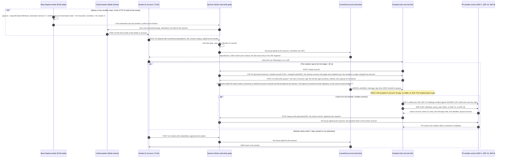
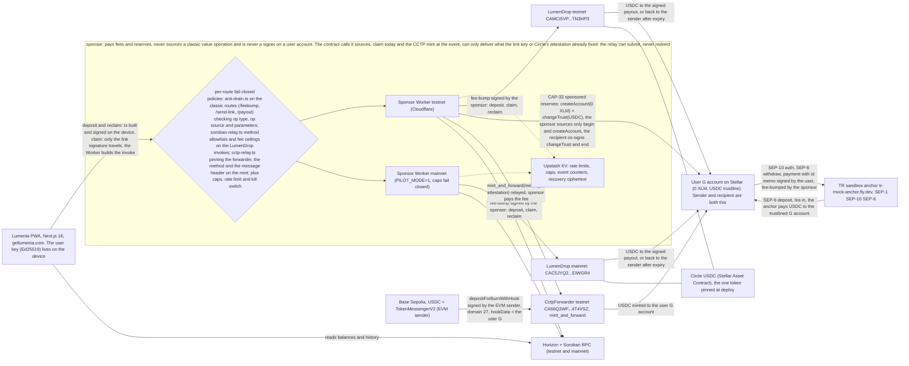

# Lumenia

**Send dollars by link; the recipient needs no wallet, no app and no XLM, and unclaimed money comes back.**

Built during the Rise In x Stellar Pro Hackathon (Scale Track, Istanbul, 19-20 Sept 2026): commits `af0aa8b..005f5c7` (19-20 Sept 2026; everything up to and including `abf1c3e` was written before the event and pushed during it). See [What was built here](#what-was-built-here-19-20-sept-2026).

Status: testnet complete; mainnet is a capped pilot, not a launch. Not audited.

Who this is for: someone in Turkey with nothing installed, receiving dollars from family or a client in Europe, and the sender who today has to talk them through installing a wallet, writing down twelve words and buying XLM before the first dollar can arrive. The recipient never pays; the sender is the leg we would eventually charge, below the channel they use now.

## Demo

- Demo video: https://youtu.be/eGqJDv0C0mk
- Live app: https://getlumenia.com (testnet by default; mainnet only for hand-approved pilot wallets)
- Mainnet pilot evidence (capped, hand-approved): the pilot line under [Honest limits](#honest-limits) and the mainnet pilot row in [SECURITY.md](SECURITY.md); testnet sprint proof in [EVIDENCE.md](EVIDENCE.md)

Three steps on testnet, two phones, no keys to install:

1. Open https://getlumenia.com on a phone (testnet is the default). Go to Add money and tap "Get test money": the testnet faucet sends 1 practice dollar (Circle testnet USDC) into an account the sponsor opens for you with 0 XLM.
2. Tap Send, enter an amount, create the link. The link card has a QR; show it to the second phone, or share the link.
3. On the second phone open the link and tap the claim button. The dollar lands in an account that did not exist a moment ago and paid no gas. Then Cash out and choose the lira rail: the sandbox anchor shows its own rate, deadline and payout account, and pays TRY to a sandbox IBAN.

## What was built here (19-20 Sept 2026)

The core of the judged pipe was built at the event. Each line names the commits and the on-chain proof.

- [x] **SEP-6 deposit, lira in, against the TR sandbox anchor.** `startDeposit` and `readDeposit` in `apps/web/lib/anchor.ts` (plain `GET /sep6/deposit`, bare asset code, `funding_method=bank_account`, no SEP-12, no SEP-38) and the Add money screen at `apps/web/app/(app)/add-money/bank`: the anchor's IBAN, beneficiary and reference shown exactly as the anchor returns them, a testnet-only "Simulate bank transfer" button, polling to `completed`, the Stellar payment linked on stellar.expert. Events `deposit_started` and `deposit_completed`. Commit `c56195f`. Proof, through the product client: 100.00 TRY paid 2.0396090 USDC in 27.4 s, Stellar payment `aa2b7fbcd241835f05ac682ae9d4845c9069c70a24fa5cc2f95b450e9b6b4841`.
- [x] **Event mode, the judge board and the five-screen flow.** `NEXT_PUBLIC_EVENT_MODE=1`; `/event` shows three tiles from live data only (people who claimed on mainnet today with seeded and organic separated, the lira rail's last round trip with times and tx links, the partner line); the event-user flow is claim, home, send, ask someone to send you dollars, cash out, one confirmation per action. Commit `771515e`. The board reads the sponsor's `/events/summary` on both networks and renders an honest empty when a counter has nothing in it.
- [x] **Circle CCTP inbound, the primary partner.** A sender holding USDC on Base burns it with a hook; Circle attests; our sponsor Worker relays `mint_and_forward(message, attestation)` on the Stellar CctpForwarder (Circle's own forwarding service does not serve Stellar as a destination); the USDC lands in the sender's Lumenia account and leaves as a link. Sponsor route `/cctp-relay` (its own tight policy: only the forwarder contract, only `mint_and_forward`, a fee ceiling, caps and rate limits, its own anti-drain tests; no existing allowlist widened) and the web page `apps/web/app/(app)/add-money/base` (connect an injected Base wallet, approve once, burn, watch the attestation, see the mint). Event `cctp_funded`. Commit `005f5c7`. Proof, through the relay module: burn `0x908916fbb97e9a99fea6b48b7295a3593f19d7bcdb6e4b362b5b26ee6630c98d`, mint `f8c20fe05cc01e8f9e051298acb88fef9e7e86a17b728cb52926c7f3b4f75a9d`, 16 s burn to mint. Through the product path, the browser client calling a sponsor Worker: burn `0x91b700cf475f3b6b6b190c28437c201515c1d6423d025a2aaaa161998c3a70e1`, mint `799da9e6d8362e8f8d86b0c4d9dbbcd9e48ca560a62e5d2486a0469e2c1760f1`, 0.9998700 USDC received, 26 s burn to mint. Replaying a spent burn is refused at simulation, at no cost.
- [ ] **Real users at the event.** Measured live, not asserted here: the funnel is public on the judge board at [`/event`](https://getlumenia.com/event) and in the sponsor's `/events/summary` on both networks, with seeded and organic separated, open-to-claim duration buckets, and team accounts excluded by hashed id. The submitted numbers are the delta between the snapshot taken before the first tester and the one taken at submission time. Seeded links ($2 from the team, marked `seeded=1` in the link query) are reported on their own line and never count as sender adoption. Every count carries its dollar value, never a count on its own. The pass marks were pre-registered before the first tester, so they cannot move afterwards: sender adoption passes at 10 or more non-team senders and at least half of qualified testers; the recipient leg passes at a median under 60 s with 90% or better claim success; the onward leg passes if at least one in five recipients moves money on within 26 hours.

## Prepared before the event (18 Sept 2026)

Groundwork so the 26 event hours went to the core. Ticked items are in the repo with the offline gate green; where a live proof exists it is named on the item. Status as of 18 Sept 22:00.

- [x] **Anchor client fixes** (`apps/web/lib/anchor.ts`, `lib/offramp.ts`, `/send-out/bank`): a memo of unknown type is refused before paying (never pay without the reference); the bare asset code is sent first as SEP-6 specifies; a 401 or 403 renews SEP-10 once and retries; polling tolerates dropped reads; `pending_customer_info_update` is terminal. `test:anchor` 92 to 108. Deployed to production on 20 Sept 2026 in `005f5c7`. Live round trip of the exact `/send-out/bank` sequence on testnet in 23 s: payment `e6398c5d61f8c2d4918e9edec03be9db4a4ab4c3c2211ffa5e0145cba523eecf`, anchor withdrawal `sep_gk64i30lc72jlkn2frzx` completed at 48.509814 TRY/USDC.
- [x] **SEP-6 deposit, lira in, proven against the sandbox anchor** with the raw SEP-6 endpoints (`pnpm --filter @lumenia/web test:anchor-deposit-live`): account `GD4LIAGTXGK3K3RQAHILP5EXZWFVR5H7NN3EUPERH7FJHWCVYYT7MFV7`, deposit `sep_4boq2k2n0ndzcnqj7m0k`, 100.00 TRY to 2.0407002 USDC, status walk `pending_anchor` to `completed` with no `pending_trust` because the trustline was already open, payment `9998a0f36184e92887697dd8147c62470c9fdf09e0dcfe6e13580ebcf094e96d`, 22.6 s. The product screen is event work.
- [x] **Measurement** (`apps/sponsor/src/lib/events.ts`, `apps/web/lib/events.ts`, `test:events` 22 to 62): a referral set (claimed and then created a link, the figure that means a recipient became a sender), a repeat set (a second value event by the same hashed account), open-to-claim duration buckets 0-15, 15-30, 30-60, 60-120 and 120+ seconds, a seeded cohort with organic = total minus seeded, team accounts excluded by hashed id, new events `link_shared`, `cashout_bank_sent`, `deposit_started`, `deposit_completed`, `cctp_funded`, `wallet_funded`. Counters and sets keyed by a truncated, unsalted SHA-256 of the account (it confirms a guessed address but names nobody); no raw addresses, links, fragments or emails are stored. Claim beacons are routed by the link's network, so a first-time recipient on mainnet is counted on mainnet (fixed in code; the first mainnet beacon was confirmed on 19 Sept 2026).
- [x] **Seeded-link tooling:** the team wallet opens `/send?seeded=1`; the link card shows a QR by default. Deployed to production on 20 Sept 2026 in `005f5c7`.
- [x] **CCTP de-risk script** `apps/sponsor/src/spike7-cctp-inbound.ts` (`pnpm --filter @lumenia/sponsor spike7`): approve + `depositForBurnWithHook` on Base Sepolia with `mintRecipient` and `destinationCaller` both set to the forwarder, the hook layout for the Stellar recipient, attestation polling, `mint_and_forward` from a relayer key. Proven end to end on Base Sepolia -> Stellar testnet on 19 Sept, before the event build: Standard finality, burn `0xf79328e104e030833a598dfb4954b252885d32b9f58c919cca89e09f2d05aa00`, mint `a5c4eae02c67b1ed6a8b6cfc9c2617cefa502e74f7414ff46c8208239412aa4d` (2.0000000 USDC received, no fee); Fast finality (`FINALITY=1000`), burn `0xddf8f16a31f3893577460ec5041204db66b8f6f009bbafc1614b49e7be6208fc`, attestation in 11 s, mint `617908c7864927191fcdddd202ba279bf8269f371ca06fd8e89bde5f0efe1261` (1.9997400 USDC received, 0.00026 fee), 18 s burn-to-mint.
- [x] **Stellar Wallets Kit, fund a link from Freighter, LOBSTR, xBull or Hot Wallet:** shipped in code on 18 Sept behind `NEXT_PUBLIC_WALLETS_KIT=1` (`apps/web/lib/wallets-kit.ts`; the external wallet signs the same escrow deposit and the sponsor fee-bumps it; event `wallet_funded`; adapter self-test 16/16). The flag is off in production for the event, because the real-wallet walk-through has not been done: it is a roadmap line here, not a claim.
- [ ] **Passkey smart account: proven on testnet, opt-in vault next.** On 18 Sept a smart account was created on testnet with a WebAuthn passkey through `smart-account-kit` while a relayer paid, and 1 USDC moved G to C and back with a passkey signature (smart account `CCXRXHGZL7IE3KZ47TEWQU5IRLB2LOY7TRGOROJ3UMHW7JDHVUYXKJIC`, deploy `bd01f59f2d741c5100e98ab5c6244faef01769343ef036b440cd39b0b3e52aed`, passkey-signed transfer `d0e0f265b6760aced3d02e1810c9ee3628f4698d051e1e5d266b494481de7926`). The spike script is not in this repo; the on-chain ids above are the proof. The opt-in vault (a sidecar next to the classic account, never the claim path, never the anchor account) is not built; it is a roadmap line.
- [x] **Agent as sender:** an MCP server (`apps/web/lib/agent-mcp.ts`, tools `create_payment_link`, `list_reclaimable`, `reclaim_link`, `agent_status`) for an agent holding its own key and USDC; the sponsor fee-bumps; the link goes to a human with no wallet; unclaimed money is reclaimed by the agent's principal, not automatically. Shipped 18 Sept on testnet: self-test 26/26, live link `709cb27e00dd34142b62d80877a10c197dd59855d643d1488c4cb854c5aac741` funded by deposit `e7d311a2456913c1d37d1e95627a0d76c2023056ddbecff46cd028dc30007261`. Q&A material, not part of the demo. Commit `7ed1ee4`.

## Problem

To receive dollars in crypto a person first installs a wallet, writes down twelve words and buys a coin to pay a fee. Say "I will send you two hundred dollars" and the other side is looking at half an hour of setup. Stablecoins are cheap and fast, and they still cannot reach the hands of someone who knows nothing about them. The pain is not sending. It is the recipient receiving without having to learn anything first. In Turkey and its diaspora people want to hold dollars, send money home and share a bill, and most tools ask for crypto literacy or paperwork before the first dollar arrives.

## Solution

Lumenia is a link. The sender locks USDC in an on-ledger escrow (LumenDrop, a Soroban contract) and shares a link over WhatsApp or as a QR. The recipient taps it, sees the amount, taps once, and the dollars sit in a Stellar account that did not exist a moment ago. The sponsor Worker opened that account and its USDC trustline with sponsored reserves and paid every fee, so the recipient pays no gas and holds zero XLM. Target ~30 s from tap to balance; the app measures it on the device and reports buckets, not a promise.

The anchor integration is the core feature: the recipient turns the link into lira without leaving the app, over SEP-1, SEP-10 and SEP-6 against the organisers' TR sandbox anchor. SEP-12 and SEP-38 clients exist in the code, tested and uncalled. The organisers' anchor walkthrough on 8 Sept 2026 showed a transfer pausing at `pending_trust` because the wallet had no trustline; the advice was to add the trustline in the background. That is what the sponsor already does, for someone holding zero XLM, so the anchor always meets a ready account.

Ways in and out:

- Lira in through the sandbox anchor (SEP-6 deposit) into the user's trustlined account.
- USDC from another chain through Circle CCTP, arriving in the sender's account and leaving as a link.
- USDC from any Stellar wallet through Stellar Wallets Kit (Freighter, LOBSTR, xBull, Hot Wallet): shipped in code behind `NEXT_PUBLIC_WALLETS_KIT=1`, off in production for the event (no real-wallet walk-through yet), so it is a roadmap line.
- Out: lira through the same anchor (SEP-6 withdraw), onward by link, or a Claimable Balance to a known address.
- Ask someone to send you dollars (request money, including splitting a bill): a request link carries the amount and a note; the payer pushes. Nobody can pull money from anyone.

Unclaimed money is not lost: the sender can take it back after seven days; reclaim is not automatic. Every claim opens a new funded Stellar account; the number we count is how many of those act again.

## How a claim works

The money path. Every edge names the SEP or the operation, and who signs. The CCTP block is built at the event; the lira leg runs on testnet against the sandbox anchor.



## Components and the trust boundary

Signers are written on the edges. Every relay route is fail-closed, each by the policy that fits it, and the sponsor box is the trust boundary. The sponsor pays fees and reserves, never sources a classic value operation and is never a signer on a user account. The contract calls it sources, claim today and the CCTP mint at the event, can only deliver what the link key or Circle's attestation already fixed: the relay can submit, never redirect.



### Why these integrations are load-bearing

Both partner legs rest on the same primitive, and neither is decoration. Our sponsor opens every account with `createAccount(0 XLM)` and `changeTrust(USDC)` inside one CAP-33 sponsored-reserves sandwich, so the anchor always meets a trustlined account: the organisers' own anchor walkthrough on 8 Sept showed a SEP-6 transfer pausing at `pending_trust` for exactly the wallet we never create, and our run walked `pending_anchor` to `completed` with no such pause. Dollars only matter to a recipient in Turkey if they can become lira, so the SEP-6 rail is the exit of the product rather than a page beside it; today it runs against the organisers' sandbox anchor on testnet, and switching to a licensed Turkish anchor is a change of home domain, nothing more. On the way in, Circle CCTP moves native USDC by burn and mint, with no wrapped token, no pool and no slippage, and Circle's forwarding service does not reach Stellar, so a Stellar recipient can only be paid through the CctpForwarder with `mintRecipient` and `destinationCaller` both set to it; our sponsor relays `mint_and_forward` and pays that fee, which is the only reason someone holding zero XLM can receive the mint at all. Take either leg out and the loop stops being a rail and goes back to being a demo.

## Who can do what

We hold no one's keys. We do hold real power, and we name it.

| Who | Can | Cannot |
|---|---|---|
| Link holder | Claim the escrowed USDC to any payout address the link key signs for (`claim`, an Ed25519 signature over contract, network, link and payout) | Change the amount, claim twice, claim after the sender took it back |
| Sender | Lock USDC behind a link (`deposit`), fund a group link (`create_drop`), take an unclaimed drop back after expiry (`reclaim`, seven days by default; not automatic), fund a known address with a Claimable Balance that names the recipient and a sender-reclaim claimant | Take it back before expiry, redirect a claim, see who claimed beyond the payout address on chain |
| Recipient | Claim into a fresh account, send onward by link, ask someone to send you dollars, cash out to lira over SEP-6 | Pull money from anyone (every flow is push-only) |
| 2-of-3 owner multisig (since 2026-09-18) | Upgrade the contract bytecode, pause new escrow (`deposit` and `create_drop`), transfer or renounce ownership | Move escrowed funds, pause `claim` or `reclaim` (exits are never pausable) |
| Relayer (the sponsor Worker) | Pay fees and reserves, decline to relay (caps, pilot allowlist, rate limits, kill switch) | Redirect a payout (the link signature binds it), source a classic value operation, sign for a user account, open an account with a balance above 0 XLM. The contract calls it sources, claim today and the CCTP mint at the event, can only deliver what the link key or Circle's attestation already fixed: the relay can submit, never redirect |
| Circle | Freeze USDC as its issuer | Nothing on our side prevents this; the site FAQ says so |
| Nobody | Move escrow in today's bytecode: the only transfers out of the contract are `claim` to the signed payout and `reclaim` to the original sender after expiry | |

There is no timelock yet, so an owner upgrade is instant; a timelock is the next governance step (roadmap tranche 2).

## Stellar integration

| What | Where | Notes |
|---|---|---|
| LumenDrop escrow (Soroban, `soroban-sdk` 26.1, OpenZeppelin `stellar-access`, `stellar-contract-utils` and `stellar-macros` 0.7.2 for Ownable, Pausable, Upgradeable) | Testnet [`CAMCI5VPRLQUL6H4QKLZ6X7ASLVCEYBYWS7N3QG7JVOA25HCY2TN3HP3`](https://stellar.expert/explorer/testnet/contract/CAMCI5VPRLQUL6H4QKLZ6X7ASLVCEYBYWS7N3QG7JVOA25HCY2TN3HP3), mainnet [`CAC5JYQ2XEEVJ54EXC7KCG6MTARO5CSUQ2WNKSOM6FALCCU5UTEIWGR4`](https://stellar.expert/explorer/public/contract/CAC5JYQ2XEEVJ54EXC7KCG6MTARO5CSUQ2WNKSOM6FALCCU5UTEIWGR4) | `deposit`, `claim`, `reclaim`, group drops (`create_drop`, `claim_share`, `reclaim_pool`). Persistent storage with TTL bumps and versioned records (`DropEntry::V1`); instance storage for the token and the owner; no temporary storage, because nothing in an escrow may expire silently. `require_auth` on deposit and reclaim; `ed25519_verify` on claim because the link holder has no account. Source: [`contracts/lumen-drop`](contracts/lumen-drop) |
| Circle USDC as a Stellar Asset Contract | Testnet issuer [`GBBD47IF6LWK7P7MDEVSCWR7DPUWV3NY3DTQEVFL4NAT4AQH3ZLLFLA5`](https://stellar.expert/explorer/testnet/asset/USDC-GBBD47IF6LWK7P7MDEVSCWR7DPUWV3NY3DTQEVFL4NAT4AQH3ZLLFLA5), mainnet issuer [`GA5ZSEJYB37JRC5AVCIA5MOP4RHTM335X2KGX3IHOJAPP5RE34K4KZVN`](https://stellar.expert/explorer/public/asset/USDC-GA5ZSEJYB37JRC5AVCIA5MOP4RHTM335X2KGX3IHOJAPP5RE34K4KZVN) | The one token pinned into the contract at deploy. Balances count only the pinned issuer |
| Sponsored reserves (CAP-33) | `POST /create-account` on the sponsor Worker | `beginSponsoringFutureReserves`, `createAccount` with 0 XLM, `changeTrust` USDC, `endSponsoringFutureReserves`; the sponsor sources only the begin and createAccount operations; the recipient co-signs changeTrust and end |
| Fee-bump transactions (CAP-15) | Every relay route: `/v2-deposit`, `/v2-claim`, `/v2-reclaim`, `/feebump`, `/payout`, `/send-link`, `/cctp-relay` | The sponsor pays the fee; for claim it also sources the invoke because the link holder has no account, and the contract binds the payout to the link signature. Each family of routes has its own fail-closed policy: `apps/sponsor/src/lib/anti-drain.ts` checks op type, op source and sensitive parameters on the classic routes (`/feebump`, `/send-link`, `/payout`), `soroban-relay.ts` allowlists the contract methods and caps the fee on the LumenDrop invokes, and `cctp-relay.ts` pins the forwarder, the method and the message header on the mint |
| Claimable Balances (CAP-23) | Sends to a known address | Two claimants: the recipient, unconditional, and the sender after seven days. The link path uses the contract instead because the payout is chosen at claim time |
| SEP-1, SEP-10, SEP-6 | `tr-mock-anchor.fly.dev` (the organisers' sandbox anchor), `SIGNING_KEY` `GDXYO6FJCNXZEWGXD54GT76FGFYLOLSOGSOJLNQ6WGHCGEQPO7NTE73M` | `apps/web/lib/anchor.ts`: SEP-1 discovery, SEP-10 challenge verified against the published `SIGNING_KEY` before the user key signs anything, SEP-6 withdraw (live) and SEP-6 deposit. The withdrawal is paid by a classic `payment` with the anchor's id memo. Switching anchors is a change of home domain |
| Circle CCTP V2 | CctpForwarder testnet [`CA66Q2WFBND6V4UEB7RD4SAXSVIWMD6RA4X3U32ELVFGXV5PJK4T4VSZ`](https://stellar.expert/explorer/testnet/contract/CA66Q2WFBND6V4UEB7RD4SAXSVIWMD6RA4X3U32ELVFGXV5PJK4T4VSZ), Stellar domain 27; Base Sepolia domain 6 | The sponsor relays `mint_and_forward`; the recipient is a trustlined Lumenia account; 6 decimals on the wire, 7 on Stellar |
| Horizon and Soroban RPC | Reads and submits, testnet and mainnet | Every product surface renders live chain data; empty states are honest empties |
| WebAuthn PRF and Argon2id | Recovery and fast unlock | One 32-byte seed sealed into a ciphertext box the server cannot open; the password is the floor, Face ID the shortcut (WhatsApp's in-app browser cannot create passkeys) |
| Stellar CLI | `stellar contract build` (`wasm32v1-none`), deploy, `stellar contract extend` for instance and code TTL | Rent is real: both networks were extended by hand and the watchdog pages before expiry |

## Design decisions and challenges

- **`pending_trust` eliminated by sponsored trustlines.** The organisers' anchor walkthrough on 8 Sept 2026 showed a SEP-6 deposit pausing at `pending_trust` because the wallet had no trustline. Lumenia never reaches that state: the sponsor opens every account with `createAccount(0 XLM)` + `changeTrust(USDC)` inside one CAP-33 sponsored-reserves sandwich at claim time, so the anchor always meets a trustlined account. The 18 Sept deposit run walked `pending_anchor` to `completed` with no `pending_trust`.
- **Every relay route is fail-closed, each by its own policy.** A sponsor that fee-bumps strangers' transactions is a drain target, so `apps/sponsor/src/lib/anti-drain.ts` checks operation type, operation source and the sensitive parameters before any signature: the sponsor may source only `beginSponsoringFutureReserves` and `createAccount`; `startingBalance` must be 0; `changeTrust` must name the pinned USDC and be recipient-sourced; a `payment` is refused unless its destination is allow-listed; a missing constraint means reject. Every new route gets its own tight policy and no existing allowlist is widened: the CCTP relay built at the event reads only a burn hash, pins the forwarder contract and `mint_and_forward`, checks the message header (source domain 6, destination 27, caller equal to the forwarder) before it simulates, and caps the fee. 60 adversarial cases in `test:antidrain`, 37 more in `test:cctp`.
- **Sponsored reserves, and what a 0-XLM account costs the sponsor.** A claim is free for the recipient and not for us: the sponsor locks about 1.5 XLM of reserves per new account (the account entry plus the USDC trustline entry) and pays the fees, and that reserve does not scale with the amount, which is why there is a minimum escrow (`MIN_DROP_USDC`) and a per-day onboarding budget. The float is finite: the watchdog pages below 40 recipients of remaining capacity during the event (25 normally), and on mainnet every cap fails closed when the counter store is unreachable.
- **Two escrow paths on purpose.** A link uses the Soroban contract (LumenDrop) because the recipient is unknown and the payout address is chosen at claim time. A send to a known address uses a Claimable Balance (CAP-23) with the recipient as the unconditional claimant and the sender as the reclaim claimant after seven days: protocol-native, no contract and no upgrade key involved. They are not unified, and on either path reclaim is an explicit action by the sender, never automatic.
- **A walletless claim signed by the link key, with the payout bound in the message.** The link holder has no account, so `claim` cannot use `require_auth`; the contract runs `ed25519_verify` over (contract, network, link, payout) against the link's public key. The secret lives only in the URL fragment and never reaches a server; the device signs, the Worker builds the invoke from a channel account it controls, and the sponsor fee-bumps it. Because the payout address is inside the signed message, the relayer that sources the call cannot redirect it; the one thing it can do is decline to relay.

## Skills and tools used

Cited by path from the official Stellar skills (https://skills.stellar.org, repo `stellar/stellar-dev-skill`):

- `skills/smart-contracts/SKILL.md`: LumenDrop storage types, auth, testing and security patterns
- `skills/dapp/SKILL.md`: `@stellar/stellar-sdk` transaction building, simulation, signing, submission
- `skills/assets/SKILL.md`: trustlines, the USDC Stellar Asset Contract
- `skills/data/SKILL.md`: Horizon and RPC reads
- `skills/standards/SKILL.md`: SEP-1, SEP-10, SEP-6
- `skills/cross-chain/cctp.md`: CCTP V2, domain 27, the CctpForwarder rule for Stellar recipients
- `skills/anchors/SKILL.md`, the community anchors skill: https://github.com/CheesecakeLabs/stellar-anchor-skill (`SKILL.md`): SEP-6 as a deliberate choice, exact memo and memo type, trustline before deposit, status as a state machine, re-run SEP-10 on 401 (the sandbox answers 403; the client handles both)

The Stellar Raven MCP and skills.stellar.org were used for the research passes before the event; the skill files above were read from the installed copies during the event build.

## Quickstart for a judge

The three-step testnet path is under [Demo](#demo). The gate:

```bash
pnpm install

# The offline gate: no network, no keys. Exactly what CI runs. Counts as of 2026-09-20.
pnpm test:antidrain                                  # 60   anti-drain validator (claim, send, payout, sweep, sequence, golden policy, muxed)
pnpm --filter @lumenia/sponsor test:kms              # 13   external Ed25519 signer path, byte parity
pnpm --filter @lumenia/sponsor test:caps             # 82   per-drop and per-day caps, onboarding budget
pnpm --filter @lumenia/sponsor test:channels         # 24   channel-account lease
pnpm --filter @lumenia/sponsor test:events           # 62   event allowlist, funnel, seeded cohort, buckets
pnpm --filter @lumenia/sponsor test:pilot            # 36   mainnet allowlist and per-wallet budget
pnpm --filter @lumenia/sponsor test:recovery-store   # 35   ciphertext-only recovery box store
pnpm --filter @lumenia/sponsor test:identity         # 66   names and ways-back-in registries
pnpm --filter @lumenia/sponsor test:identity-routes  # 39   the same through worker.fetch
pnpm --filter @lumenia/web test:recovery             # 18   recovery crypto
pnpm --filter @lumenia/web test:claimpw              # 13   claim-password derivation
pnpm --filter @lumenia/web test:receive              # 14   receive and collect logic
pnpm --filter @lumenia/web test:horizon              # 17   Horizon readers
pnpm --filter @lumenia/web test:claimerr             # 24   claim-failure classification
pnpm --filter @lumenia/web test:suggest              # 8    onboarding name suggestions
pnpm --filter @lumenia/web test:txguard              # 32   client-side guard on sponsor-built transactions
pnpm --filter @lumenia/web test:money                # 36   amount parsing and formatting
pnpm --filter @lumenia/web test:anchor               # 142  SEP-1, SEP-10, SEP-6 client: the challenge is verified before signing, deposit and withdraw
pnpm --filter @lumenia/sponsor test:cctp             # 37   the CCTP relay route on Circle's real message bytes
pnpm --filter @lumenia/web test:cctp-web             # 18   the browser half of CCTP, golden-tested against the bytes that minted
(cd contracts/lumen-drop && cargo test)              # 29   unit and property tests over the 14-invariant spec
```

20 offline suites, 776 assertions, plus 29 contract tests; every suite re-run green on 20 Sept 2026 against the submitted commit. Two more suites sit outside the gate list: the Wallets Kit adapter (`pnpm --filter @lumenia/web test:walletkit`, 16) and the agent MCP (`pnpm --filter @lumenia/web test:agentmcp`, 26). `next build` is clean.

The anchor, live, from the terminal (network, testnet only, spends nothing real):

```bash
pnpm --filter @lumenia/web test:anchor-live            # SEP-1 + SEP-10 + SEP-6 withdraw, the exact /send-out/bank sequence, 23 s measured on 18 Sept
pnpm --filter @lumenia/web test:anchor-deposit-live    # SEP-6 deposit, lira in, against the sandbox anchor, 22.6 s measured on 18 Sept
AMOUNT=2 FINALITY=1000 pnpm --filter @lumenia/sponsor spike7   # CCTP V2 inbound, Base Sepolia to Stellar testnet through the CctpForwarder: burn, Circle attestation, relayer mint. Measured 19 Sept: Fast finality 18 s burn-to-mint (burn 0xddf8f16a...08fc, mint 617908c7...1261); Standard finality proven too (burn 0xf79328e1...aa00, mint a5c4eae0...4a4d). Needs a funded Base Sepolia sender (keys in the gitignored spike file)
```

## Setup

```bash
# Node 20+, pnpm 9.12.0 (pinned in package.json); Rust and the stellar CLI only for the contract
pnpm install

# Web app (Next.js) on http://localhost:3000; testnet works with no env file
pnpm --filter @lumenia/web dev

# Sponsor Worker on http://localhost:8787 (vars from wrangler.toml, secrets from apps/sponsor/.dev.vars)
cd apps/sponsor && npx wrangler dev
```

Web env (`apps/web/.env.local`):

- `NEXT_PUBLIC_SPONSOR_URL`: the testnet sponsor Worker (defaults to the deployed testnet Worker). `NEXT_PUBLIC_LUMENDROP_CONTRACT`, `NEXT_PUBLIC_HORIZON`, `NEXT_PUBLIC_SOROBAN_RPC`: the testnet contract and endpoints (default to the ids above).
- Mainnet: `NEXT_PUBLIC_SPONSOR_URL_MAINNET` and `NEXT_PUBLIC_LUMENDROP_CONTRACT_MAINNET` (no defaults; without them the app has no mainnet configuration), `NEXT_PUBLIC_HORIZON_MAINNET` and `NEXT_PUBLIC_SOROBAN_RPC_MAINNET` (default to the public endpoints). `NEXT_PUBLIC_STELLAR_NETWORK=mainnet` makes mainnet the default network; unset means testnet.
- `NEXT_PUBLIC_ANCHOR_HOME_DOMAIN`: the anchor's home domain; the lira screens appear only when it is set (sandbox: `tr-mock-anchor.fly.dev`, testnet only).
- `NEXT_PUBLIC_WALLETS_KIT=1`: shows "Fund from another Stellar wallet" on `/send` (off by default).
- `NEXT_PUBLIC_EVENT_MODE=1`: the event flow and the `/event` judge board.
- `NEXT_PUBLIC_RP_ID` and `NEXT_PUBLIC_SITE_URL`: the WebAuthn relying-party id and the canonical site URL; `NEXT_PUBLIC_PILOT_TX_CAP_USD`: the per-transfer cap shown on `/pilot` (5).

Sponsor env: the caps and switches are plain vars in `apps/sponsor/wrangler.toml` (`[vars]` for testnet, `[env.mainnet.vars]` for mainnet: `MAX_DROP_USDC`, `MAX_DAY_USDC`, `MAX_DAY_ACCOUNTS`, `MAX_DAY_ACCOUNTS_PER_SOURCE`, `PILOT_MODE`, `CAPS_FAIL_CLOSED`, `SPONSOR_MIN_RECIPIENTS`, `EVENTS_EXCLUDE_AIDS`, ...); secrets go in with `wrangler secret put` (`SPONSOR_SECRET`, `KV_REST_API_URL`, `KV_REST_API_TOKEN`, `RESEND_API_KEY`, `PILOT_APPROVE_TOKEN`, `CHANNEL_SECRETS`); `apps/sponsor/.env.example` documents most of them for local runs; `PILOT_APPROVE_TOKEN` and `CHANNEL_SECRETS` are described in `src/lib/pilot.ts` and `src/lib/channels.ts`. Deploy: web = git push to `main` (Vercel); sponsor = `npx wrangler deploy` (testnet) and `npx wrangler deploy --env mainnet` (real money, separate secrets; deploying one never touches the other).

## Technologies

- Next.js 16.3.2 with React 19.2.8, a PWA hosted on Vercel (git push to `main` deploys)
- `@stellar/stellar-sdk` 16.3.0 in both apps: classic operations, Soroban invokes and simulation, `WebAuth.readChallengeTx` for SEP-10; the same copy the Wallets Kit resolves to; `packages/shared` still pins 16.1.0
- `soroban-sdk` 26.1 with OpenZeppelin stellar-contracts 0.7.2 (`stellar-access`, `stellar-contract-utils`, `stellar-macros`) for LumenDrop, built with `stellar contract build` to `wasm32v1-none`
- Cloudflare Workers with `nodejs_compat` for the sponsor: one codebase, two deployments from the same `wrangler.toml` (`lumenia-sponsor` on testnet, `lumenia-sponsor-mainnet` on mainnet)
- Upstash Redis over REST for counters, caps, rate limits and the ciphertext-only recovery store
- Horizon and Soroban RPC for every read and submit; Stellar Wallets Kit 2.5.0 behind a flag; viem 2.56.8 for the Base Sepolia side of the CCTP script; the MCP SDK 1.30.0 for the agent-as-sender server
- WebAuthn PRF and Argon2id for recovery and unlock

## Honest limits

- Mainnet is a hand-approved, capped pilot, not a launch: every sender wallet is admitted by hand (recipients never need approval), $5 per transfer, $50 per day, caps fail closed, a per-wallet operation budget, a kill switch and a 15-minute watchdog. As of 2026-08-28, the pilot's own count: 69 accounts opened, 109 real transfers, about $4.4 in total; median payment $0.002, maximum $1.00, 65 of 69 payments from one scripted run on 24 Aug; a plumbing proof, not demand. The day caps were raised for the two event days, in force from the 18 Sept dry run through 20 Sept, reverted at 21:00 on 20 Sept; the per-transfer cap and fail-closed did not move. The step: $400 per day instead of $50, 200 sponsored accounts per day instead of 40 and 200 per caller IP (the venue shares one Wi-Fi address), 300 requests per minute per IP, 50 operations per approved wallet, and the watchdog floor at 40 recipients instead of 25; every sender stayed hand-approved. The revert is due at 21:00 Istanbul on 20 Sept 2026.
- Not audited. The contract passed a static-analysis, property-test, fuzz and mutation pass; that is self-assessment. Opening mainnet beyond the pilot waits for a professional audit and a written Turkish legal opinion; the product is free and invite-only until then.
- The contract owner is a 2-of-3 multisig since 2026-09-18 with no timelock yet: an upgrade is instant. The owner can pause new escrow and never withdrawals; no owner path moves escrowed funds.
- The sponsor key is an environment hot key on both Workers. A KMS signer is code-complete behind the same interface and not provisioned; taking it live is in progress under the current Instaward follow-on (SOW 2).
- USDC can be frozen by its issuer, Circle. The sponsor can decline to relay; that is how the pilot limits are enforced, and it is real power.
- Unclaimed money does not return by itself: the sender can take it back after seven days; reclaim is not automatic.
- The lira rail is a sandbox anchor on testnet. No Turkish lira moved for real, and no Turkish provider is integrated. The sandbox ignores a caller-supplied payout account, so the IBAN shown is the anchor's own. SEP-12 and SEP-38 are not used.
- CCTP inbound runs on testnet (Base Sepolia to Stellar testnet) and is relayed by our sponsor; the live-run latency on the day is the number to trust, not an estimate.
- WhatsApp's in-app browser cannot create passkeys, so the claim is one tap with a key made on the device; locking the account and recovery use a password, and Face ID is offered afterwards as a faster unlock.
- The sponsor's XLM float is finite (about 1.5 XLM locked per new account); the watchdog pages below 40 recipients of remaining capacity during the event (25 normally).
- Request-money (ask someone to send you dollars) was shown for about ten seconds on stage; the hero is sending to someone with no wallet.

## Roadmap toward the SCF Build Integration Track

Lumenia is an application on existing Stellar primitives, not a new primitive, so after the current Instaward follow-on (SOW 2, ends 2026-10-17) the target is the SCF Build Integration Track; the referral path we are pursuing is Rise In. Tranches are mapped 10/20/30/40, and the final tranche is tied to one self-set on-chain metric: cumulative payment volume through registered sponsored accounts (CAP-33 sponsorship attribution, counted from Horizon) within 90 days of mainnet launch, seeded cohorts excluded. The number is set by one rule, fixed here before it can be chosen to flatter us: ten times the event's organic mainnet dollar delta over 90 days, with a floor of $500.

| Tranche | Deliverable | Proof |
|---|---|---|
| 1 (10%) | A STRIDE threat model and a monitoring plan in SDF's templates; the Integration List blocks named: the anchor over SEP-6, Stellar Wallets Kit, CCTP; KYC | The two documents delivered; the three integrations named with their code paths; the KYC plan |
| 2 (20%) | An upgrade timelock on LumenDrop in front of the 2-of-3 owner; the KMS signer live on the mainnet Worker (in progress under the current Instaward, SOW 2) | Owner address is the timelock on stellar.expert; a mainnet fee-bump signed by the KMS key |
| 3 (30%) | Testnet-complete lira in and out over SEP-6, and CCTP inbound in the product, not only the script | Round-trip hashes both ways against the anchor; a burn on Base and the mint on Stellar from the product screen |
| 4 (40%) | Mainnet with the self-set on-chain metric above | Horizon-counted volume through CAP-33-registered sponsored accounts within 90 days of launch, against the number the rule above fixes |

Next, after the tranches: a permissionless exit page and raw-key export (anyone holding XLM can submit `claim` or `reclaim` against the contract without our Worker); USDT0 as a second asset with an inbound LayerZero composer (Turkey's stablecoin volume is USDT-heavy); the Africa corridor through Yellow Card, which supports USDC on Stellar in 35+ countries and has not yet been contacted; a professional audit, then the final upgrade that removes the upgrade entrypoint and makes the escrow immutable; WhatsApp notifications through the Business API; opening mainnet beyond the pilot only after the legal opinion.

## Team

- Meric Cintosun, founder and engineer, [github.com/mericcintosun](https://github.com/mericcintosun)

Rise In x Stellar Pro Hackathon, Scale Track, Istanbul, 19-20 Sept 2026. Two Instawards received (2026). Public repo: [github.com/getlumenia/lumenia](https://github.com/getlumenia/lumenia). The deck is linked from the submission portal.
