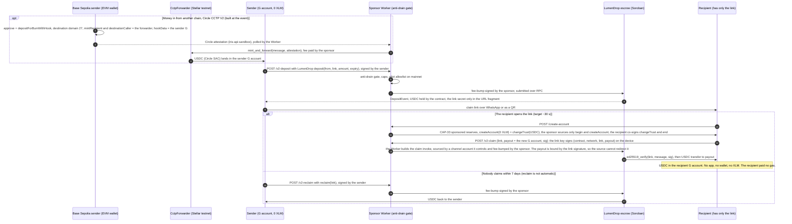
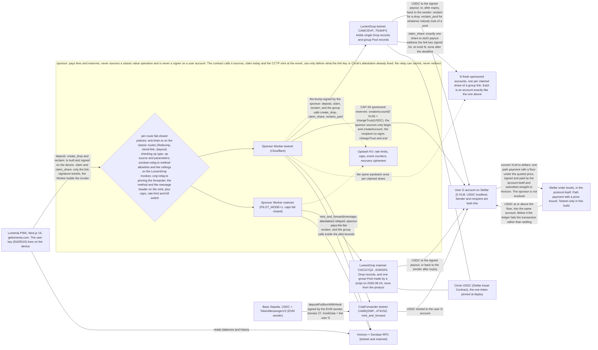

# Lumenia

**Send dollars by link; the recipient needs no wallet, no app and no XLM, and the sender can take back what nobody claims.**

Built during the Rise In x Stellar Pro Hackathon (Scale Track, Istanbul, 19-20 Sept 2026). **Submitted at `5e73e3d`** (20 Sept 2026, 11:55 Istanbul); the event commits run from `af0aa8b` to it, and everything up to and including `abf1c3e` was written before the event and pushed during it. See [What was built here](#what-was-built-here-19-20-sept-2026). Work that landed after the submission deadline is listed on its own, under [After the submission](#after-the-submission-20-24-sept-2026), and was not part of what was judged. The work since then, the Instawards follow-on with the browser extension, private links and the open-mainnet hardening, is under [Since the event](#since-the-event-the-instawards-follow-on-sow-2-2026-09-17-to-2026-10-16).

Status: testnet complete; mainnet is a capped pilot, not a launch. Not audited.

Who this is for: someone in Turkey with nothing installed, receiving dollars from family or a client in Europe, and the sender who today has to talk them through installing a wallet, writing down twelve words and buying XLM before the first dollar can arrive. The recipient never pays; the sender is the leg we would eventually charge, below the channel they use now.

## Demo

- Demo video (three minutes, recorded in a browser, July 2026): https://youtu.be/eGqJDv0C0mk
- Live app: https://getlumenia.com (testnet by default; mainnet only for hand-approved pilot wallets)
- Browser extension for senders: [Chrome Web Store](https://chromewebstore.google.com/detail/lumenia-send-dollars-by-l/ccdnjnckaldkmjnlpgpmdmnbajmakhmn), [Firefox Add-ons](https://addons.mozilla.org/en-US/firefox/addon/lumenia/); see [Browser extension](#browser-extension)
- Evidence for both Instawards, metric by metric: [EVIDENCE.md](EVIDENCE.md) (the SOW 2 follow-on first, then the closed SOW 1 testnet sprint). Mainnet pilot: the pilot line under [Honest limits](#honest-limits) and the mainnet pilot row in [SECURITY.md](SECURITY.md)

Three steps on testnet, two phones, no keys to install:

1. Open https://getlumenia.com on a phone (testnet is the default). Go to Add money and tap "Get test money": the testnet faucet sends 1 practice dollar (Circle testnet USDC) into an account the sponsor opens for you with 0 XLM.
2. Tap Send, enter an amount, create the link. The link card has a QR; show it to the second phone, or share the link.
3. On the second phone open the link and tap the claim button. The dollar lands in an account that did not exist a moment ago and paid no gas.

Two more screens, both added after the submission deadline:

4. One link for a group. On Send, follow "Paying for a group? One link, many people." Set what one person gets and how many people; the link holds the pot. Open the same link on two phones: each takes exactly one share into its own fresh account, and the shares-left figure on the claim screen is read from the contract, not from the URL. After the link closes, Notifications offers whatever nobody took back to the sender.
5. Turn XLM into dollars. On Add money, the card "You have XLM sitting here" appears only when the account really holds XLM above the ledger's own reserves. The price is read live from Stellar's order books, a floor goes under it, and the account's own key signs one path payment back into itself.

## Since the event: the Instawards follow-on (SOW 2, 2026-09-17 to 2026-10-16)

None of this was part of what the hackathon jury saw. SOW 2 has three deliverables: a sender-side browser extension, links that are private by default, and the hardening that makes opening mainnet a rehearsed configuration change. Its evidence is set out metric by metric in [EVIDENCE.md](EVIDENCE.md), with the detail in [evidence/SOW2_READINESS_REPORT.md](evidence/SOW2_READINESS_REPORT.md), [evidence/LEAK_AUDIT.md](evidence/LEAK_AUDIT.md), [evidence/ZK_SPIKE_REPORT.md](evidence/ZK_SPIKE_REPORT.md) and [evidence/SOW2_OPS_NOTE.md](evidence/SOW2_OPS_NOTE.md). Its three success metrics are not met yet: the two mainnet claims (one of a link made in the published extension, one of a private link) are the owner's real-money runs, and the sponsor still signs with an environment key until the KMS cutover.

### Browser extension

A sender-side extension for Chrome and Firefox ([`apps/extension`](apps/extension), [its README](apps/extension/README.md)). It makes a Lumenia payment link from the sender's own account in the browser they already have open, pastes it into a text box they pick with a right-click (it only inserts text and never presses Send), and shows whether each link was claimed, is still waiting, or can be taken back. The recipient never needs it: they open the link on getlumenia.com with no wallet, no app and no extension, and pay no gas.

- Chrome Web Store: https://chromewebstore.google.com/detail/lumenia-send-dollars-by-l/ccdnjnckaldkmjnlpgpmdmnbajmakhmn
- Firefox Add-ons: https://addons.mozilla.org/en-US/firefox/addon/lumenia/

Practice money (testnet) by default. Real money only for a wallet the pilot approved, with a password-locked account, after a one-time warning: $5 a link and up to $25 a day from you ($50 a day across the whole pilot). It never holds money, loads no remote code, and has no content scripts and no analytics library; what it stores and sends, and to whom, is in its README. Both stores serve a version built from this repository that makes private links: no amount anywhere in the link and no name unless one is typed (the Chrome Web Store 0.1.3 since 2026-10-10; addons.mozilla.org 0.1.3 since 2026-10-09 and 0.1.4 since 2026-10-10; hashes in [evidence/SOW2_READINESS_REPORT.md](evidence/SOW2_READINESS_REPORT.md), Published builds). The first public build, 0.1.2, made links with the amount and the sender's name in the query; an install that has not updated yet, and the self-hosted Firefox file (0.1.1), still do. 0.1.4, built on 2026-10-10, adds account management: one email backs up one account, "Ask to join" files the request for the extension's own key, signed, with its backup email, every pilot state is shown the same way as on the website, and every screen names the account in use and its email. It is public on addons.mozilla.org since 2026-10-10 (13:26 UTC); its Chrome Web Store upload is the owner's step and has not been made. A 60 fps demo of 0.1.3 on practice money is served at https://getlumenia.com/media/lumenia-extension-demo.mp4 since the 2026-10-09 web deploy. Tests: `pnpm --filter @lumenia/extension test` (9 suites, 3,314 assertions at `c961c69`, 2026-10-10, run in CI with both builds and the Firefox lint).

### Private links

A link carries no amount: the claim page reads it from the escrow on the ledger, so an edited `?a=999` no longer shows $999. Every link that the sender did not explicitly make rich has one plain chat preview, with no amount and no name. A sender's name travels only when the sender types one, and then only after the `#`, which no browser or preview bot sends to a server; anyone who can read the chat can still read it. Real-money links default to a password. Live since 2026-10-07: the nightly live run [37774557675](https://github.com/getlumenia/lumenia/actions/runs/37774557675) passed its private-link preview step against getlumenia.com. The ledger stays public: anyone holding a link's id can read its amount and the sender's account from the escrow, and the sender's @name if that account holds one. What a link, the ledger and our sponsor can each see: https://getlumenia.com/privacy. The commitment spike in the same deliverable is testnet only and does not hide the amount ([evidence/ZK_SPIKE_REPORT.md](evidence/ZK_SPIKE_REPORT.md)).

### Open-mainnet readiness

Deployed on both Workers on 2026-10-08 and held in CI by the step "Hardening suite (D3 a-k)": the Soroban relays simulate a deposit or a take-back before the sponsor signs and refuse a fee above what it needs; a per-day sponsor fee budget (15 XLM on mainnet); a per-sender day cap ($25 of the $50 day); a per-connection onboarding share (8 of the 60 sponsored accounts a day); single-shot cap accounting, so a failed deposit gives its reservation back once and never twice; an unconfirmed submission answered as unconfirmed rather than as a failure that invites a second spend; a watchdog that halts the sponsor by itself on its two theft tripwires and stamps a heartbeat that a GitHub workflow is scheduled to read every 30 minutes (GitHub has started this repository's schedules hours late; the first scheduled run is 37850573340); and the allowlist's retirement behind one variable, dry-run on a local Worker against the testnet ledger on 2026-10-08 and rehearsed on the deployed testnet Worker on 2026-10-09 (`ops/rehearsal/`: six phases, 22 logged steps, all passed). A scripted adversarial run against the live mainnet Worker refused everything it sent and spent nothing; it was refusal-only, because the exhaustion probes would lock real recipients out until UTC midnight. The release merged on 2026-10-09 (the mainnet log redaction, a subrequest budget per request, `/health` version, the halt written as soon as a tripwire is raised) runs on both Workers since 2026-10-09, and the heartbeat's alert path was drilled that day (an issue opened and closed). On 2026-10-10 both Workers took a watchdog fix (after the mainnet watchdog paged five times that day on a public RPC that answered HTTP 429, a busy or unreachable source pages only once every scheduled run for 45 minutes found it so; a refusal still pages at once, and the theft tripwires still halt in the first run that can see them), and both Workers and the website took the account-management release (one email backs up one account, every surface names the account in use, a request to join real money is signed by that account): testnet Worker version `b7876a09`, mainnet Worker version `dd9408b4` with `PILOT_MODE=1` kept and the caps unchanged, the website at `c961c69`. Still to come, the owner's: the KMS cutover (`ops/kms/`). Mainnet keeps `PILOT_MODE=1` until the written legal opinion is in hand.

## What was built here (19-20 Sept 2026)

The core of the judged pipe was built at the event. Each line names the commits and the on-chain proof.

- [x] **Event mode, the judge board and the five-screen flow.** `NEXT_PUBLIC_EVENT_MODE=1`; `/event` shows tiles from live data only (people who claimed on mainnet today with seeded and organic separated, and the partner line); the event-user flow is claim, home, send, ask someone to send you dollars, cash out, one confirmation per action. Commit `771515e`. The board reads the sponsor's `/events/summary` on both networks and renders an honest empty when a counter has nothing in it.
- [x] **Circle CCTP inbound, the primary partner.** A sender holding USDC on Base burns it with a hook; Circle attests; our sponsor Worker relays `mint_and_forward(message, attestation)` on the Stellar CctpForwarder (Circle's own forwarding service does not serve Stellar as a destination); the USDC lands in the sender's Lumenia account and leaves as a link. Sponsor route `/cctp-relay` (its own tight policy: only the forwarder contract, only `mint_and_forward`, a fee ceiling, caps and rate limits, its own anti-drain tests; no existing allowlist widened) and the web page `apps/web/app/(app)/add-money/base` (connect an injected Base wallet, approve once, burn, watch the attestation, see the mint). Event `cctp_funded`. Commit `005f5c7`. Proof, through the relay module: burn `0x908916fbb97e9a99fea6b48b7295a3593f19d7bcdb6e4b362b5b26ee6630c98d`, mint `f8c20fe05cc01e8f9e051298acb88fef9e7e86a17b728cb52926c7f3b4f75a9d`, 16 s burn to mint. Through the product path, the browser client calling a sponsor Worker: burn `0x91b700cf475f3b6b6b190c28437c201515c1d6423d025a2aaaa161998c3a70e1`, mint `799da9e6d8362e8f8d86b0c4d9dbbcd9e48ca560a62e5d2486a0469e2c1760f1`, 0.9998700 USDC received, 26 s burn to mint. Replaying a spent burn is refused at simulation, at no cost.
- [ ] **Real users at the event.** Measured live, not asserted here: the funnel is public on the judge board at [`/event`](https://getlumenia.com/event) and in the sponsor's `/events/summary` on both networks, with seeded and organic separated, open-to-claim duration buckets, and team accounts excluded by hashed id. The submitted numbers are the delta between the snapshot taken before the first tester and the one taken at submission time. Seeded links ($2 from the team, marked `seeded=1` in the link query) are reported on their own line and never count as sender adoption. Every count carries its dollar value, never a count on its own. The pass marks were pre-registered before the first tester, so they cannot move afterwards: sender adoption passes at 10 or more non-team senders and at least half of qualified testers; the recipient leg passes at a median under 60 s with 90% or better claim success; the onward leg passes if at least one in five recipients moves money on within 26 hours.

## After the submission (20-24 Sept 2026)

Everything in this section landed after the 12:00 deadline on 20 Sept 2026, so none of it was part of what the jury saw. It is here because it is the product now, and because one item is a fix to a bug that the submitted build still carried.

- [x] **A live bug found and fixed, which is why the ways in work on a new account.** The account-repair guard on the Add money screens was inverted: it read `if (bal && !bal.issuer)`, so it asked the sponsor to open the account and its USDC trustline only when the account already existed. A brand-new address, which Horizon answers 404 and the balance reader honestly reports as null, was the one account that never got the repair. That is the account a judge has. It blocked a CCTP mint and a fresh-account claim alike, and it passed every rehearsal because every rehearsal ran on a pre-warmed wallet. Fixed at every site. The CCTP relay poll also backs off to 8 s and waits out a sponsor rate limit rather than telling somebody a burn that already happened on Base has stalled.
- [x] **One link for a group: a pot of N equal shares (testnet).** Nobody in a group chat has a wallet either, so the link that works for one person had to work for six. Built entirely on entrypoints that were already in the deployed wasm: `create_drop`, `claim_share`, `reclaim_pool`, `get_pool` and `claim_message` with the group tag. The contract was not rebuilt, redeployed or re-pinned, so the escrow a judge inspects is the same one that has been on testnet since 6 Sept. New in the product: `/group` (what one person gets, how many people, a closing time, an optional shared word; the pot is computed in stroops so the contract's floor division strands nothing, and both of our own limits are checked in the form because a refusal after the sender has signed is the worst first experience the flow has); a claim screen that asks the escrow whether the link is a pool before it creates anything and shows a live shares-left figure read from `get_pool`; `/sent/<id>`, which renders a pool's four states separately so a take-back is never drawn as a full payout; and a row on `/notifications` that offers the leftover back once the link has closed. A claim reuses one payout address per device, so reopening a link cannot pay the same person twice or open a second sponsored account. The sponsor bounds its own spend on the way in, because what a share costs us is a fresh account rather than the amount: the relay reads the share count out of the signed transaction, refuses anything that is not a whole number, holds it between 2 and 30 on testnet and between 2 and 6 on mainnet (no variable can lift the mainnet ceiling past 8), and applies the minimum per share instead of per pot, so a one-cent pot cannot buy thirty sponsored accounts. Evidence a judge can run: `test:group` 45 and `test:claimerr` 44 in the browser half, `test:soroban-relay` 42 on the relay guard, and the contract's own group coverage in `cargo test`, including the named regression `reclaimed_pool_cannot_drain_another_drops_escrow` and property tests for pool conservation and bystander-pool isolation. On screen: two phones on one QR, the counter moving, and the take-back afterwards. What the ledger guarantees, what it does not, and where mainnet pools stand, are under [Honest limits](#honest-limits).
- [x] **Turn XLM into dollars, on Stellar's own order books (testnet).** Every way out of the product settles in USDC and refuses everything else, so an account holding XLM cannot reach any of them: the money is on the ledger and no surface in the product can move it. `/add-money/convert` turns what the account holds into dollars once, in that same account. The price is read first, a floor goes under it, and the ledger enforces the floor: one path payment that either lands inside the bound or fails, never a position and never a second asset left behind. The bound is mandatory in code (the builder throws without a 7dp one) and is re-checked byte for byte on the transaction that comes back from the signer, along with a single operation paying this same account in the dollars this build pins. What is spendable is computed from the account's real reserves rather than a flat buffer, a price older than 20 s is re-read, and a move of more than 2 percent needs a second tap. The sponsor is not involved at any point: the account signs, pays its own fee and submits straight to Horizon. Proof, through the product's own client against live testnet Horizon on 20 Sept, read-only: 10 XLM quoted 10.5140606 USDC with a floor of 10.3037793 at 200 bps, and 5 USDC quoted a cost of 4.7555363 XLM with a ceiling of 4.8506471, both direct with zero hops, both asserting the pinned Circle testnet issuer. `test:swap` 88 offline covers the operation building, the guard and the failure map. No conversion has been submitted on a live network, so there is no landed hash here to quote.
- [x] **The judge board, made readable without a camera.** A judge at a laptop does not need a camera: the practice link the board mints is printed under the QR as a link they can click, with its middle hidden so a projector never shows the key, the board and the code are labelled for a screen reader, and a mint failure announces itself instead of sitting in small grey type. The real-money tiles say why a zero is a zero, in one line with the figure beside it: those counters started on 19 Sept 2026, and the hand-approved pilot before them moved 109 transfers worth about $4.4 in total, median $0.002 and largest $1.00, re-counted from the public record on 6 Sept 2026.

## Prepared before the event (18 Sept 2026)

Groundwork so the 26 event hours went to the core. Ticked items are in the repo with the offline gate green; where a live proof exists it is named on the item. Status as of 18 Sept 22:00.

- [x] **Measurement** (`apps/sponsor/src/lib/events.ts`, `apps/web/lib/events.ts`, `test:events` 22 to 62): a referral set (claimed and then created a link, the figure that means a recipient became a sender), a repeat set (a second value event by the same hashed account), open-to-claim duration buckets 0-15, 15-30, 30-60, 60-120 and 120+ seconds, a seeded cohort with organic = total minus seeded, team accounts excluded by hashed id, new events `link_shared`, `cctp_funded`, `wallet_funded`. Counters and sets keyed by a truncated, unsalted SHA-256 of the account (it confirms a guessed address but names nobody); no raw addresses, links, fragments or emails are stored. Claim beacons are routed by the link's network, so a first-time recipient on mainnet is counted on mainnet (fixed in code and held by `test:extseam`; the lone `claim_opened` on the mainnet Worker on 19 Sept 2026 cannot be attributed to a mainnet link, so the first real proof is a mainnet claim counted there, see [evidence/LEAK_AUDIT.md](evidence/LEAK_AUDIT.md) row 10).
- [x] **Seeded-link tooling:** the team wallet opens `/send?seeded=1`; the link card shows a QR by default. Deployed to production on 20 Sept 2026 in `005f5c7`.
- [x] **CCTP de-risk script** `apps/sponsor/src/spike7-cctp-inbound.ts` (`pnpm --filter @lumenia/sponsor spike7`): approve + `depositForBurnWithHook` on Base Sepolia with `mintRecipient` and `destinationCaller` both set to the forwarder, the hook layout for the Stellar recipient, attestation polling, `mint_and_forward` from a relayer key. Proven end to end on Base Sepolia -> Stellar testnet on 19 Sept, before the event build: Standard finality, burn `0xf79328e104e030833a598dfb4954b252885d32b9f58c919cca89e09f2d05aa00`, mint `a5c4eae02c67b1ed6a8b6cfc9c2617cefa502e74f7414ff46c8208239412aa4d` (2.0000000 USDC received, no fee); Fast finality (`FINALITY=1000`), burn `0xddf8f16a31f3893577460ec5041204db66b8f6f009bbafc1614b49e7be6208fc`, attestation in 11 s, mint `617908c7864927191fcdddd202ba279bf8269f371ca06fd8e89bde5f0efe1261` (1.9997400 USDC received, 0.00026 fee), 18 s burn-to-mint.
- [x] **Stellar Wallets Kit, fund a link from Freighter, LOBSTR, xBull or Hot Wallet:** shipped in code on 18 Sept behind `NEXT_PUBLIC_WALLETS_KIT=1` (`apps/web/lib/wallets-kit.ts`; the external wallet signs the same escrow deposit and the sponsor fee-bumps it; event `wallet_funded`; adapter self-test 16/16). The flag is off in production for the event, because the real-wallet walk-through has not been done: it is a roadmap line here, not a claim.
- [ ] **Passkey smart account: proven on testnet, opt-in vault next.** On 18 Sept a smart account was created on testnet with a WebAuthn passkey through `smart-account-kit` while a relayer paid, and 1 USDC moved G to C and back with a passkey signature (smart account `CCXRXHGZL7IE3KZ47TEWQU5IRLB2LOY7TRGOROJ3UMHW7JDHVUYXKJIC`, deploy `bd01f59f2d741c5100e98ab5c6244faef01769343ef036b440cd39b0b3e52aed`, passkey-signed transfer `d0e0f265b6760aced3d02e1810c9ee3628f4698d051e1e5d266b494481de7926`). The spike script is not in this repo; the on-chain ids above are the proof. The opt-in vault (a sidecar next to the classic account, never the claim path) is not built; it is a roadmap line.
- [x] **Agent as sender:** an MCP server (`apps/web/lib/agent-mcp.ts`, tools `create_payment_link`, `list_reclaimable`, `reclaim_link`, `agent_status`) for an agent holding its own key and USDC; the sponsor fee-bumps; the link goes to a human with no wallet; unclaimed money is reclaimed by the agent's principal, not automatically. Shipped 18 Sept on testnet: self-test 26/26, live link `709cb27e00dd34142b62d80877a10c197dd59855d643d1488c4cb854c5aac741` funded by deposit `e7d311a2456913c1d37d1e95627a0d76c2023056ddbecff46cd028dc30007261`. Q&A material, not part of the demo. Commit `7ed1ee4`.

## Problem

To receive dollars in crypto a person first installs a wallet, writes down twelve words and buys a coin to pay a fee. Say "I will send you two hundred dollars" and the other side is looking at half an hour of setup. Stablecoins are cheap and fast, and they still cannot reach the hands of someone who knows nothing about them. The pain is not sending. It is the recipient receiving without having to learn anything first. In Turkey and its diaspora people want to hold dollars, send money home and share a bill, and most tools ask for crypto literacy or paperwork before the first dollar arrives.

## Solution

Lumenia is a link. The sender locks USDC in an on-ledger escrow (LumenDrop, a Soroban contract) and shares a link over WhatsApp or as a QR. The recipient taps it, sees the amount, taps once, and the dollars sit in a Stellar account that did not exist a moment ago. The sponsor Worker opened that account and its USDC trustline with sponsored reserves and paid every fee, so the recipient pays no gas and holds zero XLM. Target ~30 s from tap to balance; the app measures it on the device and reports buckets, not a promise.

Ways in and out:

- USDC from another chain through Circle CCTP, arriving in the sender's account and leaving as a link.
- USDC from any Stellar wallet through Stellar Wallets Kit (Freighter, LOBSTR, xBull, Hot Wallet): shipped in code behind `NEXT_PUBLIC_WALLETS_KIT=1`, off in production for the event (no real-wallet walk-through yet), so it is a roadmap line.
- XLM already sitting in the account turned into the dollars every rail here settles in, on Stellar's built-in order books, at a quoted price with a floor under it (testnet).
- Out: onward by link, a Claimable Balance to a known address, or a plain USDC payment to an exchange deposit address the person controls (`/send-out`).
- Ask someone to send you dollars (request money, including splitting a bill): a request link carries the amount and a note; the payer pushes. Nobody can pull money from anyone.

One link can also hold a pot instead of a single payment: the same escrow writes a Pool of N equal shares, each claimant takes exactly one into a fresh account, and whatever nobody took goes back to the sender after the link closes. That is a testnet feature here; see [Honest limits](#honest-limits) for what the ledger does and does not guarantee about it.

Unclaimed money is not lost: the sender can take it back after seven days; reclaim is not automatic. Every claim opens a new funded Stellar account; the number we count is how many of those act again.

## How a claim works

The money path. Every edge names the operation, and who signs. The CCTP block is built at the event.


```mermaid
sequenceDiagram
    autonumber
    participant B as Base Sepolia sender (EVM wallet)
    participant F as CctpForwarder (Stellar testnet)
    participant S as Sender (G account, 0 XLM)
    participant W as Sponsor Worker (anti-drain gate)
    participant D as LumenDrop escrow (Soroban)
    participant R as Recipient (has only the link)

    opt Money in from another chain, Circle CCTP V2 (built at the event)
        B->>B: approve + depositForBurnWithHook, destination domain 27, mintRecipient and destinationCaller = the forwarder, hookData = the sender G
        B-->>W: Circle attestation (iris-api-sandbox), polled by the Worker
        W->>F: mint_and_forward(message, attestation), fee paid by the sponsor
        F->>S: USDC (Circle SAC) lands in the sender G account
    end

    S->>W: POST /v2-deposit with LumenDrop deposit(from, link, amount, expiry), signed by the sender
    W->>W: anti-drain gate, caps, pilot allowlist on mainnet
    W->>D: fee-bump signed by the sponsor, submitted over RPC
    D-->>S: DepositEvent, USDC held by the contract, the link secret only in the URL fragment
    S->>R: claim link over WhatsApp or as a QR

    alt The recipient opens the link (target ~30 s)
        R->>W: POST /create-account
        W->>R: CAP-33 sponsored reserves, createAccount(0 XLM) + changeTrust(USDC), the sponsor sources only begin and createAccount, the recipient co-signs changeTrust and end
        R->>W: POST /v2-claim {link, payout = the new G account, sig}: the link key signs (contract, network, link, payout) on the device
        W->>D: the Worker builds the claim invoke, sourced by a channel account it controls and fee-bumped by the sponsor. The payout is bound by the link signature, so the source cannot redirect it
        D->>R: ed25519_verify(link, message, sig), then USDC transfer to payout
        Note over R: USDC in the recipient G account. No app, no wallet, no XLM. The recipient paid no gas.
    else Nobody claims within 7 days (reclaim is not automatic)
        S->>W: POST /v2-reclaim with reclaim(link), signed by the sender
        W->>D: fee-bump signed by the sponsor
        D->>S: USDC back to the sender
    end
```

## Components and the trust boundary

Signers are written on the edges. Every relay route is fail-closed, each by the policy that fits it, and the sponsor box is the trust boundary. The sponsor pays fees and reserves, never sources a classic value operation and is never a signer on a user account. The contract calls it sources, claim today and the CCTP mint at the event, can only deliver what the link key or Circle's attestation already fixed: the relay can submit, never redirect.


```mermaid
flowchart LR
    PWA["Lumenia PWA, Next.js 16, getlumenia.com. The user key (Ed25519) lives on the device"]
    G["User G account on Stellar (0 XLM, USDC trustline). Sender and recipient are both this"]
    GN["N fresh sponsored accounts, one per claimed share of a group link. Each is an account exactly like the one above"]
    LDT["LumenDrop testnet CAMCI5VP...TN3HP3. Holds single Drop records and group Pool records"]
    LDM["LumenDrop mainnet CAC5JYQ2...EIWGR4. Drop records, and one group Pool made by a script on 2026-08-24, none from the product"]
    USDC["Circle USDC (Stellar Asset Contract), the one token pinned at deploy"]
    SDEX["Stellar order books, in the protocol itself. Path payment with a price bound. Testnet only in this build"]
    NET["Horizon + Soroban RPC (testnet and mainnet)"]
    CCTP["CctpForwarder testnet CA66Q2WF...4T4VSZ, mint_and_forward"]
    BASE["Base Sepolia, USDC + TokenMessengerV2 (EVM sender)"]

    subgraph SPONSOR["sponsor: pays fees and reserves, never sources a classic value operation and is never a signer on a user account. The contract calls it sources, claim today and the CCTP mint at the event, can only deliver what the link key or Circle's attestation already fixed: the relay can submit, never redirect"]
        direction TB
        GATE{"per-route fail-closed policies: anti-drain.ts on the classic routes (/feebump, /send-link, /payout) checking op type, op source and parameters; soroban-relay.ts method allowlists and fee ceilings on the LumenDrop invokes; cctp-relay.ts pinning the forwarder, the method and the message header on the mint; plus caps, rate limit and kill switch"}
        WT["Sponsor Worker testnet (Cloudflare)"]
        WM["Sponsor Worker mainnet (PILOT_MODE=1, caps fail closed)"]
        KV["Upstash KV: rate limits, caps, event counters, recovery ciphertext"]
        GATE --> WT
        GATE --> WM
        WT -.-> KV
        WM -.-> KV
    end

    PWA -->|"deposit, create_drop and reclaim: tx built and signed on the device. claim and claim_share: only the link signature travels, the Worker builds the invoke"| GATE
    WT -->|"fee-bump signed by the sponsor: deposit, claim, reclaim, and the group calls create_drop, claim_share, reclaim_pool"| LDT
    WM -->|"fee-bump signed by the sponsor: deposit, claim, reclaim, and the group calls inside the pilot bounds"| LDM
    WT -->|"CAP-33 sponsored reserves: createAccount(0 XLM) + changeTrust(USDC), the sponsor sources only begin and createAccount, the recipient co-signs changeTrust and end"| G
    WT -.->|"the same sandwich once per claimed share"| GN
    LDT -->|"USDC to the signed payout; or, after expiry, back to the sender: reclaim for a drop, reclaim_pool for whatever nobody took of a pool"| G
    LDT -->|"claim_share: exactly one share to each payout address the link key signed for, at most N, none after the deadline"| GN
    LDM -->|"USDC to the signed payout, or back to the sender after expiry"| G
    LDT --- USDC
    LDM --- USDC
    G -->|"convert XLM to dollars: one path payment with a floor under the quoted price, signed and paid by the account itself and submitted straight to Horizon. The sponsor is not involved"| SDEX
    SDEX -->|"USDC at or above the floor, into the same account. Below it the ledger fails the transaction rather than settling"| G
    BASE -->|"depositForBurnWithHook signed by the EVM sender, domain 27, hookData = the user G"| CCTP
    WT -->|"mint_and_forward(message, attestation) relayed, sponsor pays the fee"| CCTP
    CCTP -->|"USDC minted to the user G account"| G
    WT --> NET
    WM --> NET
    PWA -->|"reads balances and history"| NET
```

### Why these integrations are load-bearing

The CCTP leg rests on the sponsor's own primitive and is not decoration. Our sponsor opens every account with `createAccount(0 XLM)` and `changeTrust(USDC)` inside one CAP-33 sponsored-reserves sandwich, so a mint always meets a trustlined account. Circle CCTP moves native USDC by burn and mint, with no wrapped token, no pool and no slippage, and Circle's forwarding service does not reach Stellar, so a Stellar recipient can only be paid through the CctpForwarder with `mintRecipient` and `destinationCaller` both set to it; our sponsor relays `mint_and_forward` and pays that fee, which is the only reason someone holding zero XLM can receive the mint at all.

The conversion step is load-bearing too, and it costs the trust boundary nothing. Every way out settles in USDC and refuses everything else, so an account holding only XLM cannot move it at all. The path payment that fixes that is built, signed, paid for and submitted by the account itself: the sponsor is out of it by construction rather than by policy, which is why the anti-drain validator (60 cases at the time), the Soroban relay's contract pin and the watchdog's stolen-key tripwire, which treats a sponsor-sourced path payment as a stolen key, are all byte-identical to the commit before this feature. The group link is not another integration and is not presented as one: it touches no partner and is filed below under design decisions, where it belongs.

## Who can do what

We hold no one's keys. We do hold real power, and we name it.

| Who | Can | Cannot |
|---|---|---|
| Link holder | Claim the escrowed USDC to any payout address the link key signs for (`claim`, an Ed25519 signature over contract, network, link and payout); take one share of a group link (`claim_share`, the same signature with a group tag in the message) | Change the amount, claim twice, claim after the sender took it back; take a second share to the same payout address, or any share once the link has closed |
| Sender | Lock USDC behind a link (`deposit`), fund a group link (`create_drop`), take an unclaimed drop back after expiry (`reclaim`, seven days by default; not automatic), fund a known address with a Claimable Balance that names the recipient and a sender-reclaim claimant | Take it back before expiry, redirect a claim, see who claimed beyond the payout address on chain |
| Recipient | Claim into a fresh account, send onward by link, ask someone to send you dollars, send dollars out to an exchange address they control | Pull money from anyone (every flow is push-only) |
| 2-of-3 owner multisig (since 2026-09-18) | Upgrade the contract bytecode, pause new escrow (`deposit` and `create_drop`), transfer or renounce ownership | Move escrowed funds, pause `claim` or `reclaim` (exits are never pausable) |
| Relayer (the sponsor Worker) | Pay fees and reserves, decline to relay (caps, pilot allowlist, rate limits, kill switch) | Redirect a payout (the link signature binds it), source a classic value operation, sign for a user account, open an account with a balance above 0 XLM. The contract calls it sources, claim today and the CCTP mint at the event, can only deliver what the link key or Circle's attestation already fixed: the relay can submit, never redirect |
| Circle | Freeze USDC as its issuer | Nothing on our side prevents this; the site FAQ says so |
| Nobody | Move escrow in today's bytecode: the only transfers out of the contract are `claim` to the signed payout and `reclaim` to the original sender after expiry | |

There is no timelock yet, so an owner upgrade is instant; a timelock is the next governance step (roadmap tranche 2).

## Stellar integration

| What | Where | Notes |
|---|---|---|
| LumenDrop escrow (Soroban, `soroban-sdk` 26.1, OpenZeppelin `stellar-access`, `stellar-contract-utils` and `stellar-macros` 0.7.2 for Ownable, Pausable, Upgradeable) | Testnet [`CAMCI5VPRLQUL6H4QKLZ6X7ASLVCEYBYWS7N3QG7JVOA25HCY2TN3HP3`](https://stellar.expert/explorer/testnet/contract/CAMCI5VPRLQUL6H4QKLZ6X7ASLVCEYBYWS7N3QG7JVOA25HCY2TN3HP3), mainnet [`CAC5JYQ2XEEVJ54EXC7KCG6MTARO5CSUQ2WNKSOM6FALCCU5UTEIWGR4`](https://stellar.expert/explorer/public/contract/CAC5JYQ2XEEVJ54EXC7KCG6MTARO5CSUQ2WNKSOM6FALCCU5UTEIWGR4) | `deposit`, `claim`, `reclaim`, and the group entrypoints already in the deployed wasm: `create_drop`, `claim_share`, `reclaim_pool`, `get_pool`. Persistent storage with TTL bumps and versioned records (`DropEntry::V1`, `PoolEntry::V1`); instance storage for the token and the owner; no temporary storage, because nothing in an escrow may expire silently. `require_auth` on deposit and reclaim; `ed25519_verify` on claim and `claim_share`, because the link holder has no account. The signed message is domain-separated by a tag, so a signature made for a single link is not a signature for a share of a pool, and a pool dedupes on the payout address it already paid. Source: [`contracts/lumen-drop`](contracts/lumen-drop) |
| Circle USDC as a Stellar Asset Contract | Testnet issuer [`GBBD47IF6LWK7P7MDEVSCWR7DPUWV3NY3DTQEVFL4NAT4AQH3ZLLFLA5`](https://stellar.expert/explorer/testnet/asset/USDC-GBBD47IF6LWK7P7MDEVSCWR7DPUWV3NY3DTQEVFL4NAT4AQH3ZLLFLA5), mainnet issuer [`GA5ZSEJYB37JRC5AVCIA5MOP4RHTM335X2KGX3IHOJAPP5RE34K4KZVN`](https://stellar.expert/explorer/public/asset/USDC-GA5ZSEJYB37JRC5AVCIA5MOP4RHTM335X2KGX3IHOJAPP5RE34K4KZVN) | The one token pinned into the contract at deploy. Balances count only the pinned issuer |
| Sponsored reserves (CAP-33) | `POST /create-account` on the sponsor Worker | `beginSponsoringFutureReserves`, `createAccount` with 0 XLM, `changeTrust` USDC, `endSponsoringFutureReserves`; the sponsor sources only the begin and createAccount operations; the recipient co-signs changeTrust and end |
| Fee-bump transactions (CAP-15) | Every relay route: `/v2-deposit`, `/v2-claim`, `/v2-reclaim`, `/feebump`, `/payout`, `/send-link`, `/cctp-relay` | The sponsor pays the fee; for claim it also sources the invoke because the link holder has no account, and the contract binds the payout to the link signature. Each family of routes has its own fail-closed policy: `apps/sponsor/src/lib/anti-drain.ts` checks op type, op source and sensitive parameters on the classic routes (`/feebump`, `/send-link`, `/payout`), `soroban-relay.ts` allowlists the contract methods and caps the fee on the LumenDrop invokes, and `cctp-relay.ts` pins the forwarder, the method and the message header on the mint. On a `create_drop` the relay also reads the share count out of the signed XDR, type-checks it, bounds it, and applies the per-share minimum, because the reserve a pool mortgages is counted in accounts and not in dollars |
| Claimable Balances (CAP-23) | Sends to a known address | Two claimants: the recipient, unconditional, and the sender after seven days. The link path uses the contract instead because the payout is chosen at claim time |
| Path payments over the built-in order books | `apps/web/lib/swap.ts` and `/add-money/convert` (testnet) | `pathPaymentStrictSend` with a mandatory `destMin`, quoted first from `GET /paths/strict-send` on Horizon and floored 200 bps under that quote on testnet, which is the only network the screen is offered on. The ledger enforces the bound: below it the transaction fails rather than settling. Strict-receive with a `sendMax` ceiling is implemented and tested, and no screen ships it yet. The account signs, pays its own fee and submits to Horizon; the sponsor is not involved |
| Circle CCTP V2 | CctpForwarder testnet [`CA66Q2WFBND6V4UEB7RD4SAXSVIWMD6RA4X3U32ELVFGXV5PJK4T4VSZ`](https://stellar.expert/explorer/testnet/contract/CA66Q2WFBND6V4UEB7RD4SAXSVIWMD6RA4X3U32ELVFGXV5PJK4T4VSZ), Stellar domain 27; Base Sepolia domain 6 | The sponsor relays `mint_and_forward`; the recipient is a trustlined Lumenia account; 6 decimals on the wire, 7 on Stellar |
| Horizon and Soroban RPC | Reads and submits, testnet and mainnet | Every product surface renders live chain data; empty states are honest empties |
| WebAuthn PRF and Argon2id | Recovery and fast unlock | One 32-byte seed sealed into a ciphertext box the server cannot open; the password is the floor, Face ID the shortcut (WhatsApp's in-app browser cannot create passkeys) |
| Stellar CLI | `stellar contract build` (`wasm32v1-none`), deploy, `stellar contract extend` for instance and code TTL | Rent is real: both networks were extended by hand and the watchdog pages before expiry |

## Design decisions and challenges

- **Every relay route is fail-closed, each by its own policy.** A sponsor that fee-bumps strangers' transactions is a drain target, so `apps/sponsor/src/lib/anti-drain.ts` checks operation type, operation source and the sensitive parameters before any signature: the sponsor may source only `beginSponsoringFutureReserves` and `createAccount`; `startingBalance` must be 0; `changeTrust` must name the pinned USDC and be recipient-sourced; a `payment` is refused unless its destination is allow-listed; a missing constraint means reject. Every new route gets its own tight policy and no existing allowlist is widened: the CCTP relay built at the event reads only a burn hash, pins the forwarder contract and `mint_and_forward`, checks the message header (source domain 6, destination 27, caller equal to the forwarder) before it simulates, and caps the fee. 82 cases in `test:antidrain` and 58 in `test:cctp` on the merged tree of 2026-10-09.
- **Sponsored reserves, and what a 0-XLM account costs the sponsor.** A claim is free for the recipient and not for us: the sponsor locks about 1.5 XLM of reserves per new account (the account entry plus the USDC trustline entry) and pays the fees, and that reserve does not scale with the amount, which is why there is a minimum escrow (`MIN_DROP_USDC`) and a per-day onboarding budget: on mainnet 60 sponsored accounts a day and 8 per connection, so two addresses cannot spend a day, and an honest retry for the same recipient is free. The float is finite: the watchdog pages below 25 recipients of remaining capacity. On mainnet the escrow caps and the pilot allowlist fail closed when the counter store is unreachable; the onboarding and fee budgets fall back to per-isolate counters instead (a soft bound across isolates), so a store outage never strands a recipient.
- **Two escrow paths on purpose.** A link uses the Soroban contract (LumenDrop) because the recipient is unknown and the payout address is chosen at claim time. A send to a known address uses a Claimable Balance (CAP-23) with the recipient as the unconditional claimant and the sender as the reclaim claimant after seven days: protocol-native, no contract and no upgrade key involved. They are not unified, and on either path reclaim is an explicit action by the sender, never automatic.
- **One link for a group, with no change to the contract.** Six people in a chat is the same problem as one person with no wallet, six times over, so the pot had to live in the escrow that already works. Every entrypoint it needs was already in the deployed wasm, which is the only reason it could ship in a day and the reason the escrow a judge inspects is the one that has been on testnet since 6 Sept: rebuilding the contract changes the wasm hash and orphans every link already minted. The record is a versioned `PoolEntry::V1` in persistent storage beside the single-drop record, the claim message is domain-separated by a tag so a signature for one shape is not a signature for the other, and `claim_share` dedupes on the payout address rather than on anything about a person, because a contract cannot see people. Two numbers a screen shows are read from the chain and never derived: the pool carries no total, and a take-back sets the remaining amount to zero and the claimed count to the full share count in the same call, so any count derived from what is left reports a take-back as a full payout.
- **A walletless claim signed by the link key, with the payout bound in the message.** The link holder has no account, so `claim` cannot use `require_auth`; the contract runs `ed25519_verify` over (contract, network, link, payout) against the link's public key. The secret lives only in the URL fragment and never reaches a server; the device signs, the Worker builds the invoke from a channel account it controls, and the sponsor fee-bumps it. Because the payout address is inside the signed message, the relayer that sources the call cannot redirect it; the one thing it can do is decline to relay.

## Skills and tools used

Cited by path from the official Stellar skills (https://skills.stellar.org, repo `stellar/stellar-dev-skill`):

- `skills/smart-contracts/SKILL.md`: LumenDrop storage types, auth, testing and security patterns
- `skills/dapp/SKILL.md`: `@stellar/stellar-sdk` transaction building, simulation, signing, submission
- `skills/assets/SKILL.md`: trustlines, the USDC Stellar Asset Contract
- `skills/data/SKILL.md`: Horizon and RPC reads
- `skills/cross-chain/cctp.md`: CCTP V2, domain 27, the CctpForwarder rule for Stellar recipients

The Stellar Raven MCP and skills.stellar.org were used for the research passes before the event; the skill files above were read from the installed copies during the event build.

## Quickstart for a judge

The three-step testnet path is under [Demo](#demo). The gate:

```bash
pnpm install

# The offline gate: no network, no keys. The list CI runs is .github/workflows/ci.yml; counts at c961c69, 2026-10-10.
pnpm test:antidrain                                  # 82    anti-drain validator (claim, send, payout, sweep, sequence, golden policy, muxed, the account and signer split, the log redaction)
pnpm --filter @lumenia/sponsor test:kms              # 153   external Ed25519 signer path, byte parity, the account and signer split, add-signer, subrequests per signing route
pnpm --filter @lumenia/sponsor test:caps             # 274   per-drop, per-day and per-sender caps, the onboarding and fee budgets
pnpm --filter @lumenia/sponsor test:channels         # 29    channel-account lease
pnpm --filter @lumenia/sponsor test:events           # 80    event allowlist, funnel, seeded cohort, buckets, unknown fields dropped
pnpm --filter @lumenia/sponsor test:cctp             # 58    the CCTP relay route on Circle's real message bytes
pnpm --filter @lumenia/sponsor test:pilot            # 190   mainnet allowlist, per-wallet budget, the retirement switch, the approval mail, the signed request to join, the pilot states
pnpm --filter @lumenia/sponsor test:recovery-store   # 149   ciphertext-only recovery box store, one email backs up one account
pnpm --filter @lumenia/sponsor test:identity         # 73    names and ways-back-in registries
pnpm --filter @lumenia/sponsor test:identity-routes  # 49    the same through worker.fetch
pnpm --filter @lumenia/sponsor test:soroban-relay    # 163   the relay guard on the LumenDrop invokes: simulation, fee bounds, share count, per-share floor, unconfirmed submissions, the log redaction, the poll budget
pnpm --filter @lumenia/sponsor test:watchdog-offline # 240   every watchdog tripwire, the automatic halt, the heartbeat stamps, a busy source paged only after 45 minutes
pnpm --filter @lumenia/sponsor fake-kv --selftest    # 38    the stand-in store the adversarial run uses
pnpm --filter @lumenia/web test:recovery             # 125   recovery crypto, and the website's backup client: always signed, a conflict instead of an overwrite, changing the backup email
pnpm --filter @lumenia/web test:claimpw              # 13    claim-password derivation
pnpm --filter @lumenia/web test:receive              # 23    receive and collect logic, practice dollars counted only once the ledger shows them
pnpm --filter @lumenia/web test:horizon              # 71    Horizon readers
pnpm --filter @lumenia/web test:claimerr             # 75    claim-failure classification, terminal against retryable, including the refusals the relay names
pnpm --filter @lumenia/web test:suggest              # 8     onboarding name suggestions
pnpm --filter @lumenia/web test:txguard              # 32    client-side guard on sponsor-built transactions
pnpm --filter @lumenia/web test:money                # 36    amount parsing and formatting
pnpm --filter @lumenia/web test:cctp-web             # 24    the browser half of CCTP, golden-tested against the bytes that minted
pnpm --filter @lumenia/web test:group                # 84    group links: the share hint, exact-multiple pots, the four pool states, the device latch
pnpm --filter @lumenia/web test:swap                 # 88    conversion: quote reading, the price bound, the guard on the signed transaction, the failure map
pnpm --filter @lumenia/web test:extseam              # 175   the extension's seam into apps/web/lib, beacons routed by the network named
pnpm --filter @lumenia/web test:walletkit            # 16    the Stellar Wallets Kit adapter (behind a flag, off in production)
pnpm --filter @lumenia/web test:agentmcp             # 30    the agent-as-sender MCP server
pnpm --filter @lumenia/web test:linkprivacy          # 74    what a link, its beacon, the send screens, the claim routes' headers and CSP may reveal
pnpm --filter @lumenia/web test:claimmeta            # 65    private and rich chat previews, the card's amount read from the ledger, only for a live link
pnpm --filter @lumenia/web test:claimledger          # 17    what the claim screen may say about the amount
pnpm --filter @lumenia/web test:claimhome            # 44    a practice link's key never becomes the home account
pnpm --filter @lumenia/web test:pilotaccess          # 217   the real-money access rules once the allowlist retires, the warning words, the pilot states, the account in use
pnpm --filter @lumenia/extension test                # 3,314 the browser extension's 9 suites
(cd contracts/lumen-drop && cargo test)              # 29    unit and property tests over the 14-invariant spec
(cd contracts/lumen-drop-commit && cargo test)       # 22    the testnet commitment spike
```

At `c961c69`, 2026-10-10 (the tree the website and both Workers run since that day), the whole offline gate, 54 commands, is green: sponsor 12 suites / 1,540 assertions plus the stand-in store's 38, web 19 / 1,217, extension 9 / 3,314 (40 suites / 6,071), and the escrow contract's 29 tests and the spike contract's 22, unchanged since no contract changed. On the merged tree of 2026-10-09 it was 40 suites / 4,388 (sponsor 12 / 1,270 plus 35, web 19 / 945, extension 9 / 2,173), with three typechecks clean, the web lint at 0 warnings, the web and extension builds, and `web-ext lint` with 0 errors. CI also runs the escrow's strict clippy, `cargo-audit`, `cargo-deny` and a 90 percent line-coverage gate, the spike contract's tests, the web lint and production build, and the extension's typecheck, both builds and the Firefox lint. Counts move as checks are added; the per-suite table for the open-mainnet hardening is in [evidence/SOW2_READINESS_REPORT.md](evidence/SOW2_READINESS_REPORT.md) section D3.2.

CCTP inbound, live, from the terminal (network, testnet only, spends nothing real):

```bash
AMOUNT=2 FINALITY=1000 pnpm --filter @lumenia/sponsor spike7   # CCTP V2 inbound, Base Sepolia to Stellar testnet through the CctpForwarder: burn, Circle attestation, relayer mint. Measured 19 Sept: Fast finality 18 s burn-to-mint (burn 0xddf8f16a...08fc, mint 617908c7...1261); Standard finality proven too (burn 0xf79328e1...aa00, mint a5c4eae0...4a4d). Needs a Base Sepolia sender funded with test USDC and a little test ETH (see the script's header)
```

## Setup

```bash
# Node 20+, pnpm 9.12.0 (pinned in package.json); Rust and the stellar CLI only for the contract
pnpm install

# Web app (Next.js) on http://localhost:3000; testnet works with no env file
pnpm --filter @lumenia/web dev

# Sponsor Worker on http://localhost:8787 (vars from wrangler.toml, secrets from apps/sponsor/.dev.vars)
cd apps/sponsor && npx wrangler dev
```

Web env (`apps/web/.env.local`):

- `NEXT_PUBLIC_SPONSOR_URL`: the testnet sponsor Worker (defaults to the deployed testnet Worker). `NEXT_PUBLIC_LUMENDROP_CONTRACT`, `NEXT_PUBLIC_HORIZON`, `NEXT_PUBLIC_SOROBAN_RPC`: the testnet contract and endpoints (default to the ids above).
- Mainnet: `NEXT_PUBLIC_SPONSOR_URL_MAINNET` and `NEXT_PUBLIC_LUMENDROP_CONTRACT_MAINNET` (no defaults; without them the app has no mainnet configuration), `NEXT_PUBLIC_HORIZON_MAINNET` and `NEXT_PUBLIC_SOROBAN_RPC_MAINNET` (default to the public endpoints). `NEXT_PUBLIC_STELLAR_NETWORK=mainnet` makes mainnet the default network; unset means testnet.
- `NEXT_PUBLIC_WALLETS_KIT=1`: shows "Fund from another Stellar wallet" on `/send` (off by default).
- `NEXT_PUBLIC_EVENT_MODE=1`: the event flow and the `/event` judge board.
- `NEXT_PUBLIC_RP_ID` and `NEXT_PUBLIC_SITE_URL`: the WebAuthn relying-party id and the canonical site URL; `NEXT_PUBLIC_PILOT_TX_CAP_USD`: the per-transfer cap shown on `/pilot` (5).

Sponsor env: the caps and switches are plain vars in `apps/sponsor/wrangler.toml` (`[vars]` for testnet, `[env.mainnet.vars]` for mainnet: `MAX_DROP_USDC`, `MAX_DAY_USDC`, `MAX_DAY_USDC_PER_SENDER`, `MAX_DAY_FEE_XLM`, `MAX_DAY_ACCOUNTS`, `MAX_DAY_ACCOUNTS_PER_SOURCE`, `PILOT_MODE`, `CAPS_FAIL_CLOSED`, `SPONSOR_MIN_RECIPIENTS`, `EVENTS_EXCLUDE_AIDS`, ...); secrets go in with `wrangler secret put` (`SPONSOR_SECRET`, `KV_REST_API_URL`, `KV_REST_API_TOKEN`, `RESEND_API_KEY`, `PILOT_APPROVE_TOKEN`, `CHANNEL_SECRETS`); `apps/sponsor/.env.example` documents most of them for local runs; `PILOT_APPROVE_TOKEN` and `CHANNEL_SECRETS` are described in `src/lib/pilot.ts` and `src/lib/channels.ts`. Deploy: web = git push to `main` (Vercel); sponsor = `npx wrangler deploy` (testnet) and `npx wrangler deploy --env mainnet` (real money, separate secrets; deploying one never touches the other).

## Technologies

- Next.js 16.3.8 with React 19.2.8, a PWA hosted on Vercel (git push to `main` deploys)
- `@stellar/stellar-sdk` 16.3.0 in both apps: classic operations, Soroban invokes and simulation; the same copy the Wallets Kit resolves to; `packages/shared` still pins 16.1.0
- `soroban-sdk` 26.1 with OpenZeppelin stellar-contracts 0.7.2 (`stellar-access`, `stellar-contract-utils`, `stellar-macros`) for LumenDrop, built with `stellar contract build` to `wasm32v1-none`
- Cloudflare Workers with `nodejs_compat` for the sponsor: one codebase, two deployments from the same `wrangler.toml` (`lumenia-sponsor` on testnet, `lumenia-sponsor-mainnet` on mainnet)
- Upstash Redis over REST for counters, caps, rate limits and the ciphertext-only recovery store
- Horizon and Soroban RPC for every read and submit; Stellar Wallets Kit 2.5.0 behind a flag; viem 2.56.8 for the Base Sepolia side of the CCTP script; the MCP SDK 1.30.0 for the agent-as-sender server
- WebAuthn PRF and Argon2id for recovery and unlock

## Honest limits

- Mainnet is a hand-approved, capped pilot, not a launch: every sender wallet is admitted by hand (recipients never need approval), $5 a link and up to $25 a day from one sender ($50 a day across the whole pilot), the escrow caps fail closed, a per-wallet operation budget, a sponsor fee budget of 15 XLM a day, 60 sponsored accounts a day and 8 per connection, a kill switch and a 15-minute watchdog that halts the sponsor by itself on its two theft tripwires. As of 2026-08-28, the pilot's own count: 69 accounts opened, 109 real transfers, about $4.4 in total; median payment $0.002, maximum $1.00, 65 of 69 payments from one scripted run on 24 Aug; a plumbing proof, not demand. For the two event days the day caps were raised, in force from the 18 Sept dry run: $400 per day instead of $50, 200 sponsored accounts per day instead of 40 and 200 per caller IP (the venue shares one Wi-Fi address), 300 requests per minute per IP, 50 operations per approved wallet, and the watchdog floor at 40 recipients instead of 25; the per-transfer cap, fail-closed and the allowlist did not move, and every sender stayed hand-approved. The revert was due at 21:00 Istanbul on 20 Sept 2026 and landed on 24 Sept in `858e999`, three and a half days late; nothing was spent while the step stood (the sponsor held 239.6774331 XLM on 20 Sept and on 24 Sept).
- Not audited. The contract passed a static-analysis, property-test, fuzz and mutation pass; that is self-assessment. Opening mainnet beyond the pilot waits only for a written Turkish legal opinion: since SOW 2's hardening it is one rehearsed configuration change. A professional security review and a timelock gate two other steps, raising the caps materially and renouncing the escrow's upgrade key. The product is free and invite-only until the opinion is in hand.
- The contract owner is a 2-of-3 multisig since 2026-09-18 with no timelock yet: an upgrade is instant. The owner can pause new escrow and never withdrawals; no owner path moves escrowed funds.
- The sponsor key is an environment hot key on both Workers. A KMS signer is code-complete behind the same interface and not provisioned; since 2026-10-08 the sponsor account is configured apart from its signer, so the cutover is one SetOptions on the existing account, and it is the last open part of SOW 2's metric 3.
- USDC can be frozen by its issuer, Circle. The sponsor can decline to relay; that is how the pilot limits are enforced, and it is real power.
- Unclaimed money does not return by itself: the sender can take it back after seven days; reclaim is not automatic.
- No fiat rail: Lumenia never turns dollars into lira and integrates no Turkish provider. Cashing out is a plain USDC payment to an exchange address the person controls (`/send-out`), and the `/cash-out` guide walks the licensed route from there.
- CCTP inbound runs on testnet (Base Sepolia to Stellar testnet) and is relayed by our sponsor; the live-run latency on the day is the number to trust, not an estimate.
- **What a group link guarantees, and what it does not.** The ledger guarantees at most N shares, exactly the same amount each, only to a payout address the link key signed for, and nothing after the deadline. It does not guarantee one share per person. The contract keys uniqueness on the payout address, and addresses are free, so a person with two browser profiles can take two shares. The sender's own screen carries that sentence under the create button, in those words, and says which part the shared word does and does not do. Three things sit in front of that and none of them is identity: the optional shared word keeps people who were never sent the link out of it, the relay is the only thing that will fee-bump a claim for someone holding no XLM, and the device latch stops the same phone claiming twice. The relay's part is policy, not law: `claim_share` carries no `require_auth`, so anyone holding XLM and a valid link signature could submit it without us. Per-share one-time codes and a claimant allowlist are the named next step and are not built. The share floor (0.01 USDC) and the share ceiling are ours, not the contract's, and the $90 demo pool is sized by our own $100 testnet per-drop cap rather than by any limit in the escrow.
- **Group links were a testnet feature in the submission.** The screen renders on real money inside the pilot bounds (a pot of at most $5 across at most 6 shares, with a hard ceiling of 8 in the code that no variable can raise, and the same per-share floor), and the relay enforces those bounds again on its own side, which is the half somebody who skips the screen cannot skip. No pool has been created from the product on mainnet. One pool exists on the mainnet escrow: a script made it during the 24 Aug 2026 coverage run, outside the product, with its fee paid by a key that is not the sponsor's (`create_drop` [41c21e53](https://stellar.expert/explorer/public/tx/41c21e536ed03141a8cd6b42d9c7ad2d7d0e9abce82599ce6d5d9f6fac74385a), 0.03 USDC in 3 shares), and its three shares were claimed through the sponsor's relay ([f6c4d29b](https://stellar.expert/explorer/public/tx/f6c4d29b14d64618c6233cb304f223bf69b7da77efb3d9b99c7272edf4ecec3e), [24bea372](https://stellar.expert/explorer/public/tx/24bea3724d1b977bafad86e72a47b39df46cbdb6946dde7a142f8e6b6708acc5), [992a5e08](https://stellar.expert/explorer/public/tx/992a5e08e471ee71b9499d7323e0168feb0e9bc7b82ffade9b7efd4c77b0b204)). One gap in our own code was found and closed after the deadline: a group claim link did not carry the `?n=public` marker the recipient's device reads, so a real-money pot would have been opened against the testnet escrow and labelled practice money. It now carries it, exactly as the one-to-one link always has; testnet is still the only path that has been walked end to end.
- **Turning XLM into dollars runs on testnet and has never been submitted on a live network.** The two quotes named earlier are real reads of testnet order books through the product's own client; no conversion transaction has been signed or sent, so there is no landed hash to quote, and a testnet price is not a market price (on 20 Sept a testnet dollar cost about 0.95 XLM, while a dollar on mainnet costs about five). It ships on Stellar's own order books, as a path payment with a price bound, and not on Soroswap. Soroswap is deployed on testnet, but its testnet pools trade their own test USDC, `CB3TLW74NBIOT3BUWOZ3TUM6RFDF6A4GVIRUQRQZABG5KPOUL4JJOV2F`, while this product and the LumenDrop escrow pin Circle testnet USDC, `GBBD47IF6LWK7P7MDEVSCWR7DPUWV3NY3DTQEVFL4NAT4AQH3ZLLFLA5`, so a Soroswap testnet swap would hand us an asset the escrow does not take. No Soroswap call ships in this build and no key for one exists: the name appears in this paragraph and nowhere else in the repository.
- WhatsApp's in-app browser cannot create passkeys, so the claim is one tap with a key made on the device; locking the account and recovery use a password, and Face ID is offered afterwards as a faster unlock.
- The sponsor's XLM float is finite (about 1.5 XLM locked per new account); the watchdog pages below 25 recipients of remaining capacity (40 while the event step stood, 18 to 24 Sept).
- Request-money (ask someone to send you dollars) was shown for about ten seconds on stage; the hero is sending to someone with no wallet.

## Roadmap toward the SCF Build Integration Track

Lumenia is an application on existing Stellar primitives, not a new primitive, so after the current Instaward follow-on (SOW 2, 2026-09-17 to 2026-10-16) the target is the SCF Build Integration Track. It changed from the Open Track on 2026-09-18, because the SCF Handbook sends integrating applications to the Integration Track; the referral comes through Rise In, and the timing depends on traction. Tranches are mapped 10/20/30/40, and the final tranche is tied to one self-set on-chain metric: cumulative payment volume through registered sponsored accounts (CAP-33 sponsorship attribution, counted from Horizon) within 90 days of mainnet launch, seeded cohorts excluded. The number is set by one rule, fixed here before it can be chosen to flatter us: ten times the event's organic mainnet dollar delta over 90 days, with a floor of $500.

| Tranche | Deliverable | Proof |
|---|---|---|
| 1 (10%) | A STRIDE threat model and a monitoring plan in SDF's templates; the Integration List blocks named: Stellar Wallets Kit, CCTP; KYC | The two documents delivered; the two integrations named with their code paths; the KYC plan |
| 2 (20%) | An upgrade timelock on LumenDrop in front of the 2-of-3 owner; the KMS signer live on the mainnet Worker (in progress under the current Instaward, SOW 2) | Owner address is the timelock on stellar.expert; a mainnet fee-bump signed by the KMS key |
| 3 (30%) | CCTP inbound in the product, not only the script | A burn on Base and the mint on Stellar from the product screen |
| 4 (40%) | Mainnet with the self-set on-chain metric above | Horizon-counted volume through CAP-33-registered sponsored accounts within 90 days of launch, against the number the rule above fixes |

Named next work on what shipped here: per-share one-time codes and a claimant allowlist for group links, which is the only honest way to bind a share to a person rather than to an address; the strict-receive half of the conversion, "reach exactly this many dollars", which is written and tested and has no screen yet.

Next, after the tranches: a permissionless exit page and raw-key export (anyone holding XLM can submit `claim` or `reclaim` against the contract without our Worker); USDT0 as a second asset with an inbound LayerZero composer (Turkey's stablecoin volume is USDT-heavy); the Africa corridor through Yellow Card, which supports USDC on Stellar in 35+ countries and has not yet been contacted; a professional audit, then the final upgrade that removes the upgrade entrypoint and makes the escrow immutable; WhatsApp notifications through the Business API; opening mainnet beyond the pilot only after the legal opinion.

## Team

- Meric Cintosun, founder and engineer, [github.com/mericcintosun](https://github.com/mericcintosun)

Rise In x Stellar Pro Hackathon, Scale Track, Istanbul, 19-20 Sept 2026. Two Instawards received (2026). Public repo: [github.com/getlumenia/lumenia](https://github.com/getlumenia/lumenia). The deck is linked from the submission portal.
